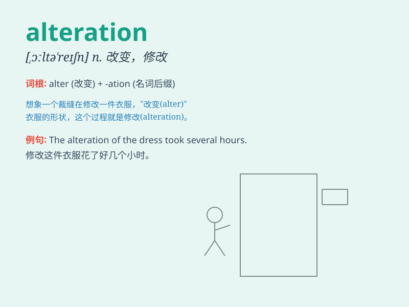

## alteration

**英音:** _[ɔːltə\'reɪʃ(ə)n; \'ɒl-]_ **美音:**
_[,ɔltə\'reʃən]_

**译义:** *n.变更,改造*

### 短语

+ **make an alteration:** _进行更改_

+ **minor alteration:** _微小的改动_

+ **substantial alteration:** _重大改变_

+ **clothing alteration:** _衣服修改_

+ **structural alteration:** _结构变更_

### 例句

#### 例句1

> **The alteration of the dress made it more fashionable.**

**中文翻译:** 这条裙子的改动让它更时尚了。

**单词释义:** 改动；改变

#### 例句2

> **There has been a slight alteration in the schedule.**

**中文翻译:** 日程有了一点小变动。

**单词释义:** 变动；变化

#### 例句3

> **The alteration to the building\'s design was approved by the
committee.**

**中文翻译:** 这座建筑设计的更改得到了委员会的批准。

**单词释义:** 更改；修改

### 背诵小故事

> A tailor was making alterations to a dress. He changed the length and
style, showing that \'alteration\' means making changes. The dress
looked completely different in the end.

**一位裁缝正在对一条裙子进行修改。他改变了长度和款式，这表明'alteration'意味着做出改变。最后裙子看起来完全不同了。**

### 图义

