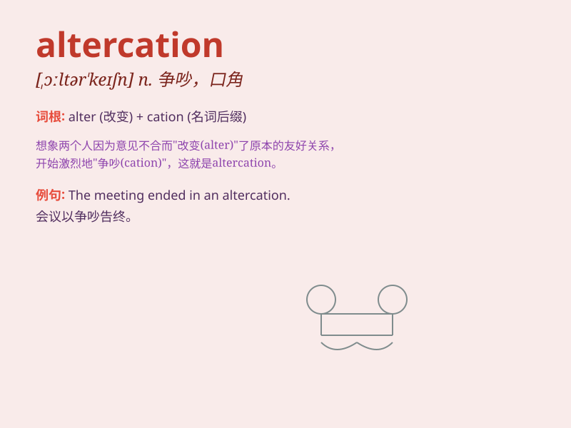

## altercation

**英音:** _[ɒltə\'keɪʃ(ə)n]_ **美音:** _[,ɔltɚ\'keʃən]_

**译义:** *n.争论,口角*

### 短语

+ **heated altercation:** _激烈的争吵_

+ **verbal altercation:** _言语上的争吵_

+ **minor altercation:** _小争吵_

+ **public altercation:** _公开的争吵_

+ **fierce altercation:** _激烈的争执_

### 例句

#### 例句1

> **The two drivers got into an altercation over a parking space.**

**中文翻译:** 这两个司机因为一个停车位发生了争执。

**单词释义:** 争执，争吵

#### 例句2

> **There was a heated altercation between the customer and the
waiter.**

**中文翻译:** 顾客和服务员之间发生了激烈的争吵。

**单词释义:** 争吵，口角

#### 例句3

> **The political debate turned into an altercation.**

**中文翻译:** 这场政治辩论变成了一场争吵。

**单词释义:** 争论，争吵

### 背诵小故事

> Two friends were having a picnic. Suddenly, they had an altercation
over which fruit was tastier. Their voices rose, and faces turned red.
But in the end, they realized it was a silly fight and made up.

**两个朋友正在野餐。突然，他们因为哪种水果更好吃发生了争吵。他们声音提高，脸也变红了。但最后，他们意识到这是一场愚蠢的争吵并和好了。**

### 图义

