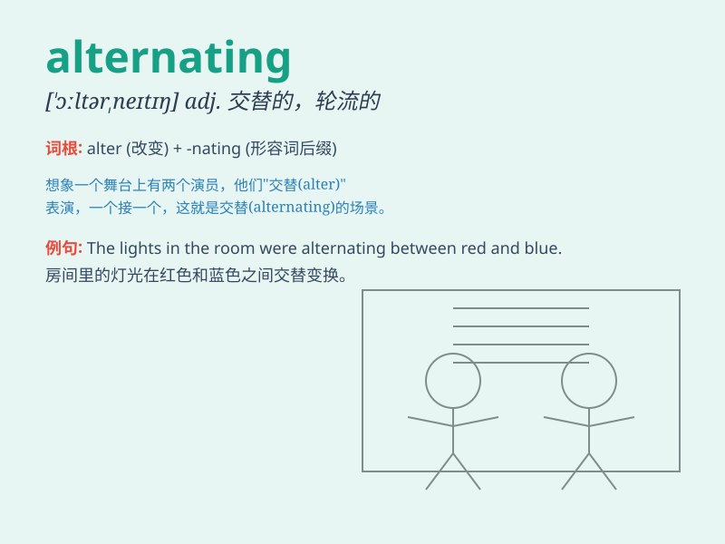

## alternating

**英音:** _[\'ɔːltəneɪtɪŋ]_ **美音:** _[\'ɔltɚnətɪŋ]_

**译义:** *adj.交互的*

### 短语

+ **alternating current:** _交流电_

+ **alternating voltage:** _交流电压_

+ **alternating stress:** _交变应力_

+ **alternating series:** _交错级数_

+ **alternating magnetic field:** _交变磁场_

### 例句

#### 例句1

> **The fan has an alternating current motor.**

**中文翻译:** 这台风扇有一个交流电动机。

**单词释义:** 交流的

#### 例句2

> **The team members took turns in an alternating pattern.**

**中文翻译:** 团队成员以交替的模式轮流。

**单词释义:** 交替的

#### 例句3

> **The light was flashing in an alternating sequence.**

**中文翻译:** 灯光以交替的顺序闪烁。

**单词释义:** 交替的；轮流的

### 背诵小故事

>
想象有个神奇的电路，电流一会儿向上流，一会儿向下流，这种一会儿向上一会儿向下的流动就是\'alter
nating\'。就像我们的心情，有时高兴，有时低落，交替变化。

**想象一个关于电流交替流动的神奇电路来辅助记忆\'交替的，轮流的\'这个单词的意思**

### 图义

