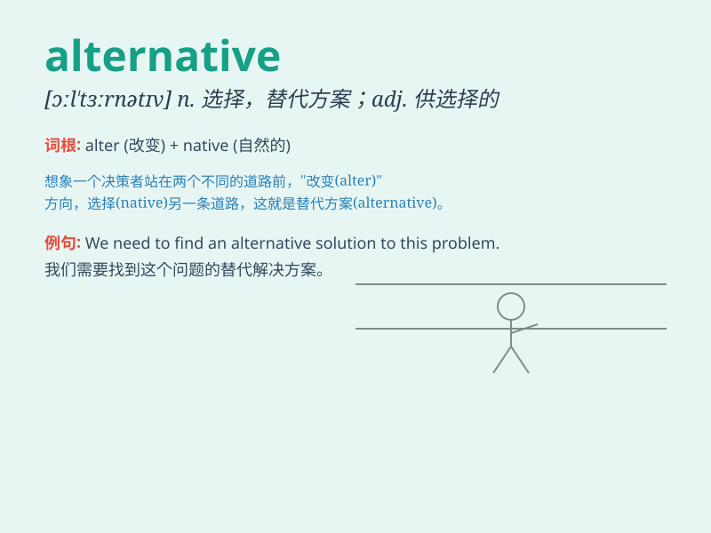

## alternative

**英音:** _[ɔːl\'tɜːnətɪv; ɒl-]_ **美音:**
_[ɔl\'tɝnətɪv]_

**译义:** *n.二中择一,可供选择的办法,事物adj.选择性的,二中择一的*

### 短语

+ **alternative energy:** _替代能源_

+ **alternative medicine:** _替代医学；非传统医学_

+ **have no alternative:** _别无选择_

+ **alternative route:** _替代路线_

+ **alternative lifestyle:** _另类生活方式_

### 例句

#### 例句1

> **We have no alternative but to go ahead with the project.**

**中文翻译:** 我们别无选择，只能继续推进这个项目。

**单词释义:** 可供选择的事物；替代选择

#### 例句2

> **There are several alternative routes to get to the airport.**

**中文翻译:** 有几条去机场的替代路线。

**单词释义:** 可供替代的；另外的

#### 例句3

> **Alternative energy sources are becoming more important.**

**中文翻译:** 替代能源正变得越来越重要。

**单词释义:** 替代的；非传统的

### 背诵小故事

>
想象一下，你在沙漠中迷路，水快喝完了。突然发现两条路，一条是继续往前走，可能会遇到水源，这是常规选择；另一条是往回走，去寻找之前经过的绿洲，这就是
alternative 选择。

**想象一下，你在沙漠迷路，水快喝完。突然发现两条路，一条常规，另一条就是可替代的选择。**

### 图义

