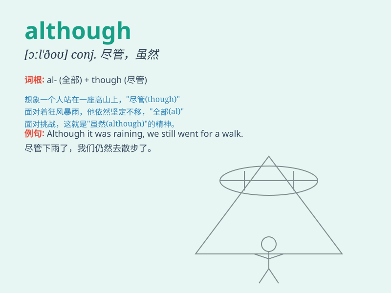

## although

**英音:** _[ɔːl\'ðəʊ; ɒl-]_ **美音:** _[ɔl\'ðo]_

**译义:** * conj.虽然,尽管*

### 短语

+ **although though:** _虽然；尽管_

+ **even although:** _即使；纵然_

+ **although if:** _虽然如果_

+ **although yet:** _虽然但是_

+ **although still:** _虽然仍然_

### 例句

#### 例句1

> **Although he is very tired, he still keeps working.**

**中文翻译:** 虽然他非常累，但他仍然继续工作。

**单词释义:** 虽然；尽管

#### 例句2

> **Although it was raining hard, we still went for a walk.**

**中文翻译:** 尽管雨下得很大，我们还是去散步了。

**单词释义:** 尽管；虽然

#### 例句3

> **Although she is young, she is very talented.**

**中文翻译:** 虽然她年纪小，但她非常有才华。

**单词释义:** 虽然；尽管

### 背诵小故事

> Once upon a time, a little girl wanted to play outside although it
was raining. Her mom said no. But the girl insisted, showing that
\'although\' means despite something.

**从前，有个小女孩想出去玩，尽管正在下雨。她妈妈说不行。但小女孩坚持，这表明'although'的意思是尽管。**

### 图义

