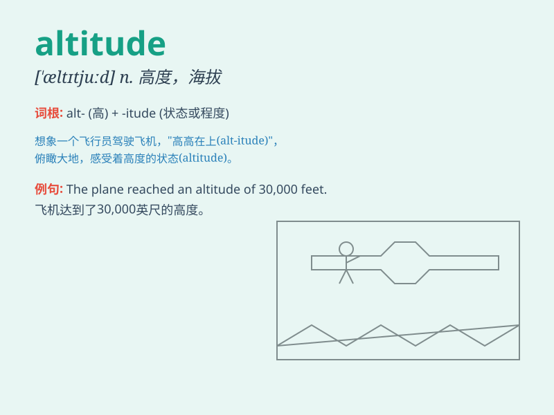

## altitude

**英音:** _[\'æltɪtjuːd]_ **美音:** _[\'æltɪtud]_

**译义:**
*n.(尤指海拔)高度,高处(海拔甚高的地方),(等级,地位等)高等*

### 短语

+ **absolute altitude:** _绝对高度_

+ **high altitude:** _高海拔_

+ **altitude sickness:** _高原反应_

+ **flight altitude:** _飞行高度_

+ **low altitude:** _低海拔_

### 例句

#### 例句1

> **The airplane climbed to a high altitude.**

**中文翻译:** 这架飞机攀升到了很高的高度。

**单词释义:** 高度；海拔

#### 例句2

> **He suffered from altitude sickness when climbing the
mountain.**

**中文翻译:** 他爬山时患上了高原反应。

**单词释义:** 海拔高度

#### 例句3

> **The satellite orbits at an altitude of several hundred
kilometers.**

**中文翻译:** 这颗卫星在几百千米的高度轨道运行。

**单词释义:** 高度

### 背诵小故事

> A brave pilot was flying a plane. He had to be careful with the
altitude. If it was too low, he might hit something. If it was too high,
the air would be too thin. So, altitude is the height above sea level.

**一位勇敢的飞行员正在驾驶飞机。他必须小心飞行高度。如果太低，他可能会撞到东西。如果太高，空气会太稀薄。所以，altitude
就是海拔高度。**

### 图义

