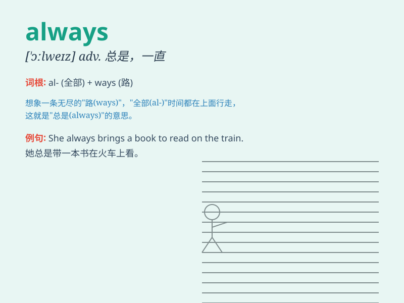

## always

**英音:** _[ˈɔ:lweɪz]_ **美音:** _[\'ɔlwez]_

**译义:** *adv.总是,永远,始终*

### 短语

+ **always on:** _一直开着；永远在线_

+ **always ready:** _随时准备好_

+ **always the case:** _总是这样；一贯如此_

+ **almost always:** _几乎总是_

+ **not always:** _不总是；并非总是_

### 例句

#### 例句1

> **She always arrives early for work.**

**中文翻译:** 她上班总是早到。

**单词释义:** 总是

#### 例句2

> **He is always smiling.**

**中文翻译:** 他总是面带微笑。

**单词释义:** 总是

#### 例句3

> **They always have dinner together on Sundays.**

**中文翻译:** 他们星期天总是一起吃晚餐。

**单词释义:** 总是

### 背诵小故事

> A little ant was always trying to find food for its colony. No matter
how hard the journey was, it was always persistent. It showed us that
\'always\' means at all times, without exception.

**一只小蚂蚁总是努力为它的蚁群寻找食物。无论路途多么艰难，它总是坚持不懈。这向我们展示了'always'意味着一直，毫无例外。**

### 图义

