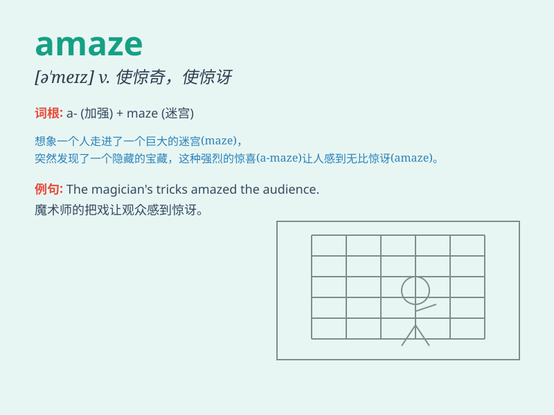

## amaze

**英音:** _[ə\'meɪz]_ **美音:** _[ə\'mez]_

**译义:** *vt.使吃惊*

### 短语

+ **amaze sb:** _使某人惊讶_

+ **be amazed at:** _对\...\...感到惊讶_

+ **in amazement:** _惊讶地_

+ **amazing thing:** _令人惊奇的事_

+ **amaze the world:** _震惊世界_

### 例句

#### 例句1

> **The magic show amazed the children.**

**中文翻译:** 魔术表演让孩子们惊叹不已。

**单词释义:** 使惊奇

#### 例句2

> **I was amazed by her talent in painting.**

**中文翻译:** 我对她的绘画天赋感到惊讶。

**单词释义:** 使惊讶

#### 例句3

> **His courage amazed everyone present.**

**中文翻译:** 他的勇气让在场的所有人都惊叹不已。

**单词释义:** 使震惊

### 背诵小故事

> One day, I went to a magic show. The magician\'s tricks were so
wonderful that they amazed me. I couldn\'t believe my eyes. It was an
amazing experience.

**有一天，我去看了一场魔术表演。魔术师的戏法太精彩了，让我感到十分惊讶。我简直不敢相信自己的眼睛。这是一次令人惊奇的经历。**

### 图义

