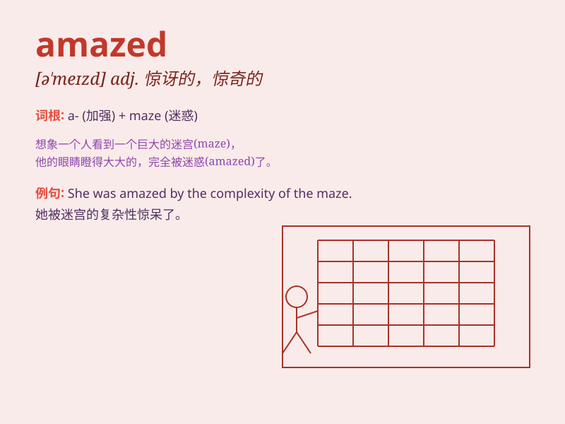

## amazed

**英音:** _[ə\'meɪzd]_ **美音:** _[ə\'mezd]_

**译义:** *adj.吃惊的,惊奇的*

### 短语

+ **be amazed at:** _对\...\...感到惊讶_

+ **be amazed to do sth:** _惊讶地做某事_

+ **leave sb amazed:** _使某人惊讶_

+ **amazed look:** _惊讶的表情_

+ **amazed expression:** _惊讶的表情_

### 例句

#### 例句1

> **I was amazed at her knowledge of French literature.**

**中文翻译:** 我对她对法国文学的了解感到惊讶。

**单词释义:** 感到惊讶

#### 例句2

> **He looked amazed when he heard the news.**

**中文翻译:** 当他听到这个消息时，他显得很惊讶。

**单词释义:** 感到惊讶

#### 例句3

> **We were all amazed by the magic show.**

**中文翻译:** 我们都被魔术表演惊呆了。

**单词释义:** 感到惊讶；感到震惊

### 背诵小故事

> One day, I saw a magic show. The magician\'s tricks were so wonderful
that I was amazed. I couldn\'t believe my eyes and my mouth opened wide.
It was an unforgettable experience.

**有一天，我看了一场魔术表演。魔术师的戏法太精彩了，我感到十分惊奇。我简直不敢相信自己的眼睛，嘴巴张得大大的。这是一次难忘的经历。**

### 图义

