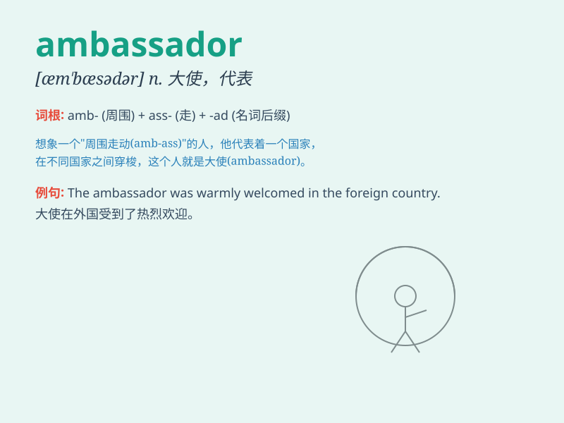

## ambassador

**英音:** _[æm\'bæsədə]_ **美音:** _[æm\'bæsədɚ]_

**译义:** *n.大使*

### 短语

+ **ambassador extraordinary:** _特命大使_

+ **ambassador plenipotentiary:** _全权大使_

+ **goodwill ambassador:** _亲善大使_

+ **cultural ambassador:** _文化大使_

+ **honorary ambassador:** _名誉大使_

### 例句

#### 例句1

> **The ambassador presented his credentials to the president.**

**中文翻译:** 大使向总统递交了国书。

**单词释义:** 大使

#### 例句2

> **She was appointed as the ambassador to France.**

**中文翻译:** 她被任命为驻法国大使。

**单词释义:** 大使

#### 例句3

> **The ambassador worked hard to improve relations between the two
countries.**

**中文翻译:** 大使为改善两国关系做出了努力。

**单词释义:** 大使

### 背诵小故事

> A king sent a brave man to a foreign land. This man was called
Ambassador. He had the important task of making friends and solving
problems between the two kingdoms. His wisdom and courage made him a
great ambassador.

**一位国王派遣了一个勇敢的人去外国。这个人被称为大使。他肩负着在两个王国之间交朋友和解决问题的重要任务。他的智慧和勇气使他成为了一位出色的大使。**

### 图义

