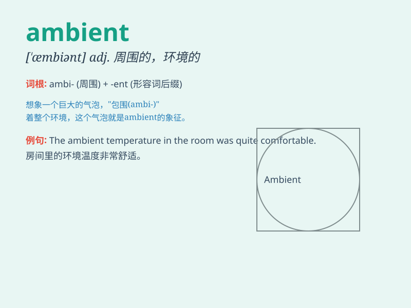

## ambient

**英音:** _[\'æmbɪənt]_ **美音:** _[\'æmbɪənt]_

**译义:** *adj.周围的n.周围环境*

### 短语

+ **ambient temperature:** _环境温度；周围温度_

+ **ambient pressure:** _环境压力；周围压力_

+ **ambient light:** _环境光；背景光_

+ **ambient noise:** _环境噪声；背景噪声_

+ **ambient air:** _环境空气；周围空气_

### 例句

#### 例句1

> **The ambient temperature in the room was quite comfortable.**

**中文翻译:** 房间里的环境温度还是很舒服的。

**单词释义:** 周围环境的；周围的

#### 例句2

> **The music created an ambient atmosphere in the café.**

**中文翻译:** 音乐营造了咖啡馆的氛围。

**单词释义:** 环境的；氛围的

#### 例句3

> **Ambient light filled the forest, making it seem magical.**

**中文翻译:** 周围的光线充满了森林，看起来很神奇。

**单词释义:** 周围的；环境的

### 背诵小故事

> In a forest, the soft light and gentle breeze created an ambient
atmosphere. The light was not direct but spread evenly, and the breeze
was not strong but surrounded us gently. \'Ambient\' means surrounding
or existing everywhere.

**在一片森林里，柔和的光线和轻柔的微风营造出一种环境氛围。光线不是直射的而是均匀散布，微风不是强烈的而是轻柔地围绕着我们。\'ambient\'意思是周围的；到处存在的。**

### 图义

