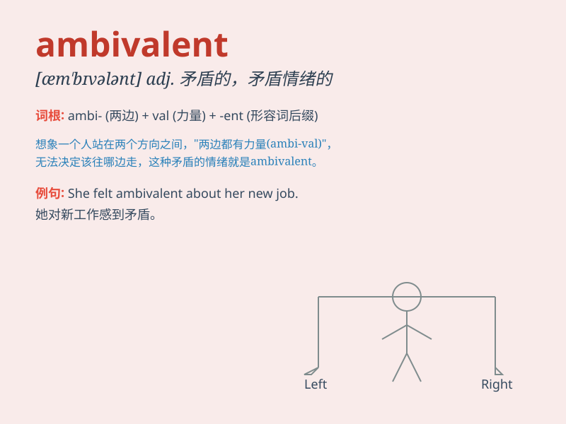

## ambivalent

**英音:** _[æm\'bɪv(ə)l(ə)nt]_ **美音:**
_[æm\'bɪvələnt]_

**译义:** *adj.矛盾的,好恶相克的*

### 短语

+ **be ambivalent about:** _对\...\...感到矛盾_

+ **ambivalent attitude:** _矛盾的态度_

+ **ambivalent feelings:** _矛盾的感情_

+ **ambivalent response:** _矛盾的回应_

+ **ambivalent position:** _矛盾的立场_

### 例句

#### 例句1

> **She has an ambivalent attitude towards marriage. **

**中文翻译:** 她对于婚姻的态度是矛盾的。

**单词释义:** 矛盾的

#### 例句2

> **I feel ambivalent about this decision. **

**中文翻译:** 我对这个决定感到矛盾。

**单词释义:** 矛盾的

#### 例句3

> **His ambivalent feelings made it hard for him to choose. **

**中文翻译:** 矛盾的心情让他难以抉择。

**单词释义:** 矛盾的

### 背诵小故事

> A man was offered a job with high salary but long hours. He felt
ambivalent. He loved the money but hated the lack of free time. This
confusion and having mixed feelings is what ambivalent means.

**一个男人得到了一份高薪但工作时间长的工作。他感到矛盾。他喜欢钱但讨厌没有空闲时间。这种困惑和有复杂的感情就是'ambivalent（矛盾的；好恶参半的）'的意思。**

### 图义

