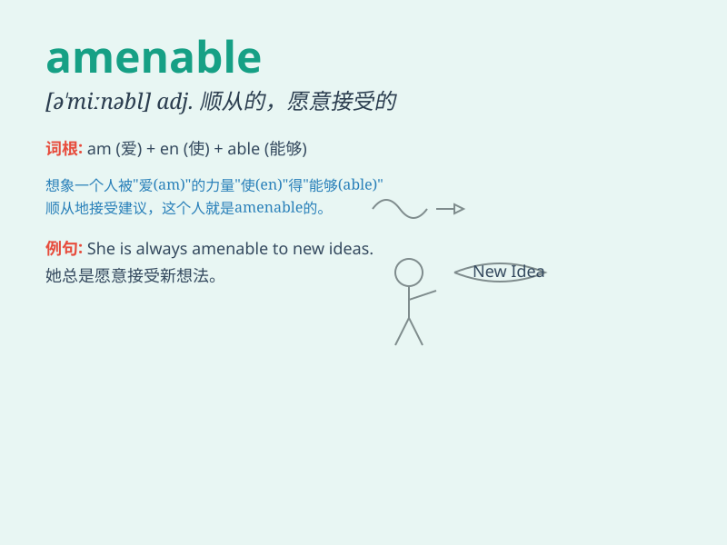

## amenable

**英音:** _[ə\'miːnəb(ə)l]_ **美音:** _[ə\'minəbl]_

**译义:** *adj.应服从的,有服从义务的,有责任的*

### 短语

+ **amenable to:** _顺从的；愿意接受的；经得起检验的_

+ **be amenable for:** _对\...\...负责_

+ **amenable person:** _随和的人_

+ **amenable proposal:** _可接受的提议_

+ **amenable solution:** _可行的解决方案_

### 例句

#### 例句1

> **The child is usually amenable to reason.**

**中文翻译:** 孩子通常很容易讲道理。

**单词释义:** 愿意听从

#### 例句2

> **He is amenable to new ideas.**

**中文翻译:** 他乐于接受新想法。

**单词释义:** 愿意接受

#### 例句3

> **The problem is not amenable to easy solution.**

**中文翻译:** 这个问题并不容易解决。

**单词释义:** 经得起；适合

### 背诵小故事

> A man was always willing to follow the rules and be cooperative. So,
people said he was amenable. One day, he easily accepted a difficult
task and completed it well. Now you know \'amenable\' means willing to
be controlled or influenced.

**一个男人总是愿意遵守规则并且乐于合作。所以，人们说他是顺从的。有一天，他轻易地接受了一项困难的任务并且完成得很好。现在你知道\'amenable\'意思是愿意被控制或影响。**

### 图义

