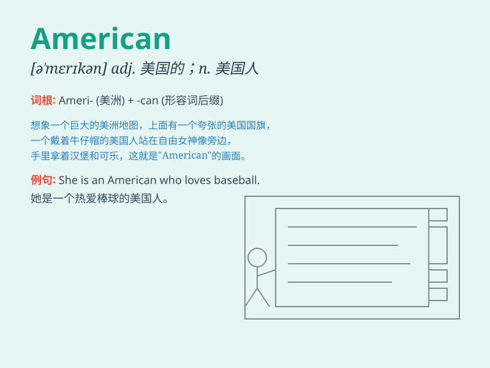

## American

**英音:** _[əˈmerɪkən]_ **美音:** _[əˈmɛrɪkən]_

**译义:** *adj.美国的，美洲的；美国人的n.美国人，美洲人；美国英语*

### 短语

+ **American English:** _美式英语_

+ **American Dream:** _美国梦_

+ **Native American:** _美洲原住民；印第安人_

+ **South American:** _南美洲的；南美人_

+ **Central American:** _中美洲的；中美洲人_

### 例句

#### 例句1

> **He is an American.**

**中文翻译:** 他是一个美国人。

**单词释义:** 美国人

#### 例句2

> **The American flag is red, white and blue.**

**中文翻译:** 美国国旗是红、白、蓝三色的。

**单词释义:** 美国的

#### 例句3

> **She has an American accent.**

**中文翻译:** 她有美国口音。

**单词释义:** 美国的

### 背诵小故事

> A boy named Tom always dreamed of visiting the Statue of Liberty. One
day, he finally went to New York and felt proud to be an American. He
saw the beautiful landscapes and met friendly people.

**一个叫汤姆的男孩一直梦想着去看自由女神像。有一天，他终于去了纽约，为自己是美国人而感到自豪。他看到了美丽的风景，还遇到了友好的人。**

### 图义

