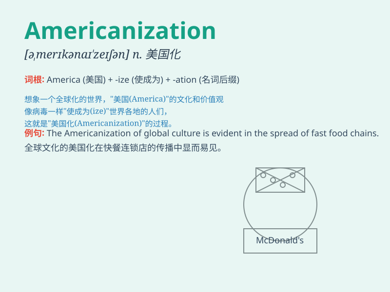

## Americanization

**英音:** _[əˌmerɪkənaɪˈzeɪʃən]_ **美音:**
_[əˌmɛrɪkənaɪˈzeɪʃən]_

**译义:** *n. 美国化；美国文化的普及*

### 短语

+ **the process of Americanization:** _美国化的过程_

+ **resist Americanization:** _抵制美国化_

+ **accelerate Americanization:** _加速美国化_

+ **cultural Americanization:** _文化美国化_

+ **economic Americanization:** _经济美国化_

### 例句

#### 例句1

> **The process of Americanization has had a significant impact on
global culture.**

**中文翻译:** 美国化的进程对全球文化产生了重大影响。

**单词释义:** 美国化

#### 例句2

> **We should be cautious about the excessive Americanization of our
local traditions.**

**中文翻译:** 我们应该警惕本地传统的过度美国化。

**单词释义:** 美国化

#### 例句3

> **The company\'s products show a certain degree of Americanization
in design.**

**中文翻译:** 这家公司的产品在设计上呈现出一定程度的美国化。

**单词释义:** 美国化

### 背诵小故事

> Once upon a time, in a small town, there was a trend of
Americanization. People started wearing American-style clothes, eating
American food, and even speaking English like Americans. This was the
process of Americanization.

**从前，在一个小镇上，出现了美国化的趋势。人们开始穿美式服装，吃美式食物，甚至像美国人一样说英语。这就是美国化的过程。**

### 图义

