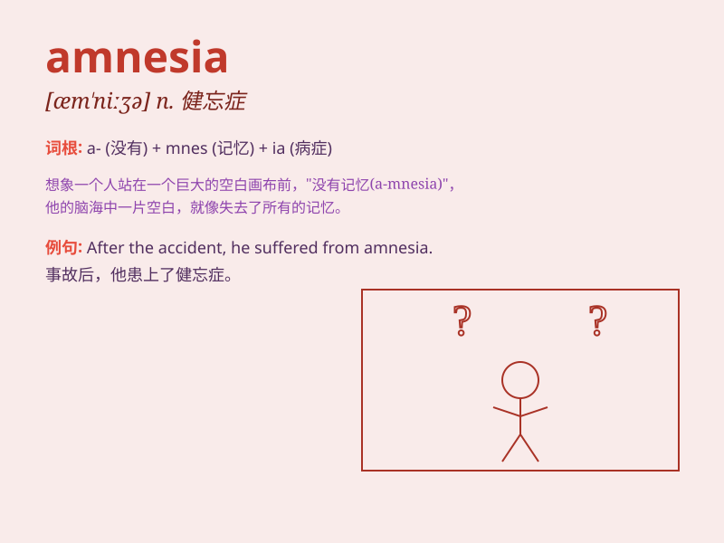

## amnesia

**英音:** _[æm\'niːzɪə]_ **美音:** _[æm\'niʒə]_

**译义:** *n.健忘症*

### 短语

+ **retrograde amnesia:** _逆行性遗忘_

+ **anterograde amnesia:** _顺行性遗忘_

+ **traumatic amnesia:** _创伤性遗忘_

+ **global amnesia:** _全面性遗忘_

+ **selective amnesia:** _选择性遗忘_

### 例句

#### 例句1

> **He suffered from amnesia after the accident and couldn\'t
remember anything.**

**中文翻译:** 事故发生后，他患上了失忆症，什么都不记得了。

**单词释义:** 失忆症

#### 例句2

> **The movie is about a woman who wakes up with amnesia and tries to
piece together her past.**

**中文翻译:**
这部电影讲述了一个患有失忆症的女人醒来并试图拼凑她的过去的故事。

**单词释义:** 失忆症

#### 例句3

> **Her amnesia made it difficult for her to recognize her own
family.**

**中文翻译:** 她的失忆症让她很难认出自己的家人。

**单词释义:** 失忆症

### 背诵小故事

> One day, a man woke up with amnesia. He couldn\'t remember anything
about himself or his past. He felt lost and confused. But with the help
of a doctor, he slowly started to regain his memories.

**有一天，一个男人醒来后患上了失忆症。他对自己和过去的任何事情都记不起来了。他感到迷茫和困惑。但在医生的帮助下，他慢慢地开始恢复记忆。**

### 图义

