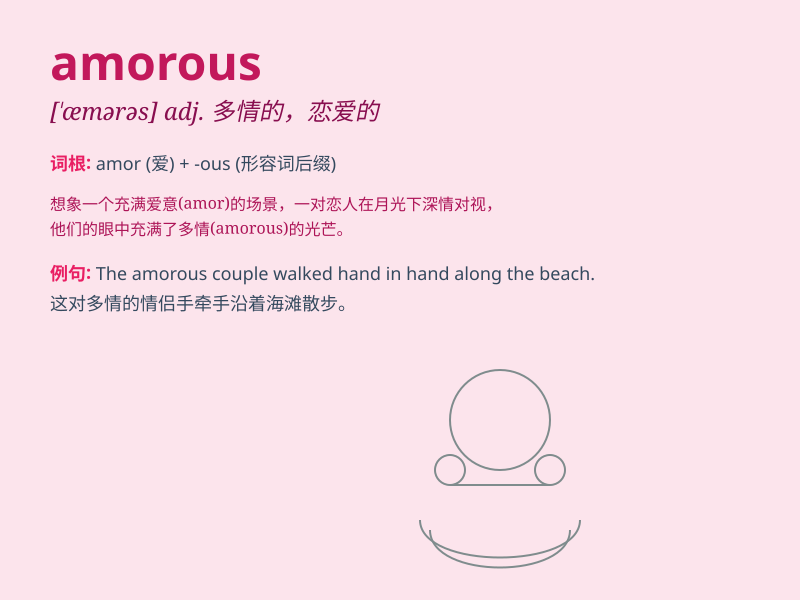

## amorous

**英音:** _[\'æm(ə)rəs]_ **美音:** _[\'æmərəs]_

**译义:** *adj.多情的,恋爱的,表示爱情的*

### 短语

+ **amorous glances:** _含情脉脉的目光_

+ **amorous feelings:** _多情的感受；爱恋之情_

+ **amorous adventures:** _浪漫的冒险经历_

+ **an amorous couple:** _一对多情的情侣_

+ **amorous poetry:** _情诗_

### 例句

#### 例句1

> **He gave her an amorous look.**

**中文翻译:** 他给了她一个深情的眼神。

**单词释义:** 含情脉脉的；多情的

#### 例句2

> **The couple engaged in amorous embraces on the beach.**

**中文翻译:** 夫妻俩在海滩上深情拥抱。

**单词释义:** 多情的；恋爱的

#### 例句3

> **She wrote amorous poems to her lover.**

**中文翻译:** 她为她的爱人写下了多情的诗篇。

**单词释义:** 表示爱情的；恋爱的

### 背诵小故事

> A young man named Tom was always amorous. He sent flowers and wrote
love letters to the girl he liked. His passionate and loving actions
made the girl feel very special.

**一个叫汤姆的年轻人总是多情的。他给喜欢的女孩送花并写情书。他充满激情和爱意的举动让女孩觉得自己很特别。**

### 图义

