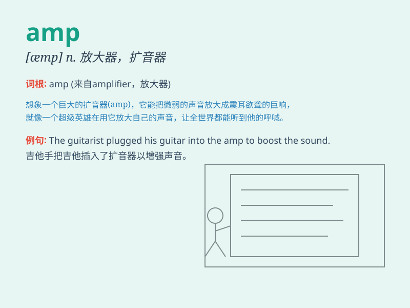

## amp

**英音:** _[æmp]_ **美音:** _[æmp]_

**译义:** *n. 放大器，扩音器；电灯泡；（非正式）能量，活力*

### 短语

+ **amp up:** _增强；加大；使更刺激_

+ **power amp:** _功率放大器_

+ **op amp:** _运算放大器_

+ **guitar amp:** _吉他放大器_

+ **amp hour:** _安时（电量单位）_

### 例句

#### 例句1

> **The guitar amplifier gives a powerful sound.**

**中文翻译:** 这把吉他放大器发出了强大的声音。

**单词释义:** 放大器

#### 例句2

> **The electrical current is measured in amps.**

**中文翻译:** 电流以安培为单位进行测量。

**单词释义:** 安培（电流单位）

#### 例句3

> **He needs to replace the faulty amp in his stereo system.**

**中文翻译:** 他需要更换他音响系统中出故障的放大器。

**单词释义:** 放大器

### 背诵小故事

> Once upon a time, there was a little ant named Amp. It was very
strong and could carry heavy things. People remembered it for its power.
So, when they saw \'amp\', they thought of this powerful ant.

**从前，有一只叫安普的小蚂蚁。它非常强壮，能搬很重的东西。人们因为它的力量记住了它。所以，当他们看到'amp'这个词，就会想起这只有力量的蚂蚁。**

### 图义

