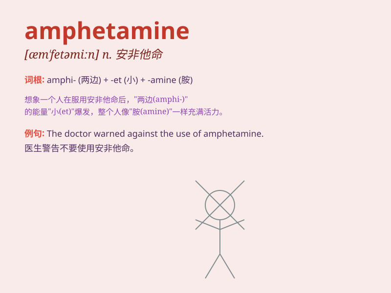

## amphetamine

**英音:** _[æm\'fetəmiːn; -ɪn]_ **美音:**
_[æm\'fɛtəmin]_

**译义:** *n.[药]安非他明*

### 短语

+ **amphetamine abuse:** _安非他命滥用_

+ **amphetamine addiction:** _安非他命成瘾_

+ **amphetamine psychosis:** _安非他命精神病_

+ **amphetamine overdose:** _安非他命过量_

+ **amphetamine trafficking:** _安非他命贩运_

### 例句

#### 例句1

> **He was arrested for possessing amphetamine.**

**中文翻译:** 他因持有安非他明而被捕。

**单词释义:** 安非他命（一种兴奋剂）

#### 例句2

> **The athlete tested positive for amphetamine.**

**中文翻译:** 该运动员安非他明检测呈阳性。

**单词释义:** 安非他命（一种兴奋剂）

#### 例句3

> **She was addicted to amphetamine and needed treatment.**

**中文翻译:** 她对安非他明上瘾，需要治疗。

**单词释义:** 安非他命（一种兴奋剂）

### 背诵小故事

> A thief was caught stealing amphetamine. The police said this drug
makes people hyperactive and affects their minds. We must stay away from
it.

**一个小偷被抓到偷安非他命。警察说这种毒品会让人过度兴奋并且影响他们的心智。我们一定要远离它。**

### 图义

