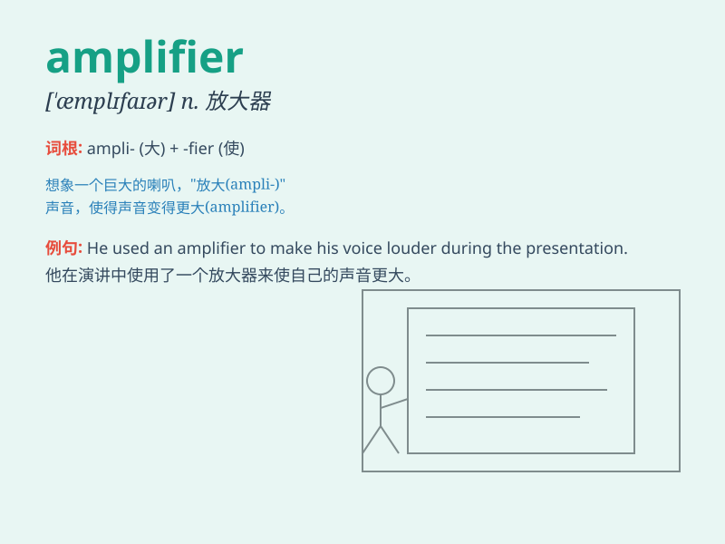

## amplifier

**英音:** _[\'æmplɪfaɪə]_ **美音:** _[\'æmplɪfaɪɚ]_

**译义:** *n.[电工]扩音器,放大器*

### 短语

+ **power amplifier:** _功率放大器_

+ **audio amplifier:** _音频放大器_

+ **voltage amplifier:** _电压放大器_

+ **current amplifier:** _电流放大器_

+ **op-amp amplifier:** _运算放大器_

### 例句

#### 例句1

> **The amplifier boosts the sound of the guitar.**

**中文翻译:** 放大器增强吉他的声音。

**单词释义:** 放大器

#### 例句2

> **We need to install a new amplifier for the home theater
system.**

**中文翻译:** 我们需要为家庭影院系统安装一个新的放大器。

**单词释义:** 放大器

#### 例句3

> **The signal was too weak until it passed through the
amplifier.**

**中文翻译:** 信号在通过放大器之前太弱。

**单词释义:** 放大器

### 背诵小故事

> A little mouse was very weak in its voice. But with an amplifier, its
squeaks became loud and powerful. Just like the amplifier boosts
signals, it makes weak things stronger.

**一只小老鼠的声音非常微弱。但是有了放大器，它的吱吱声变得响亮而有力。就像放大器增强信号一样，它让弱小的东西变得强大。**

### 图义

