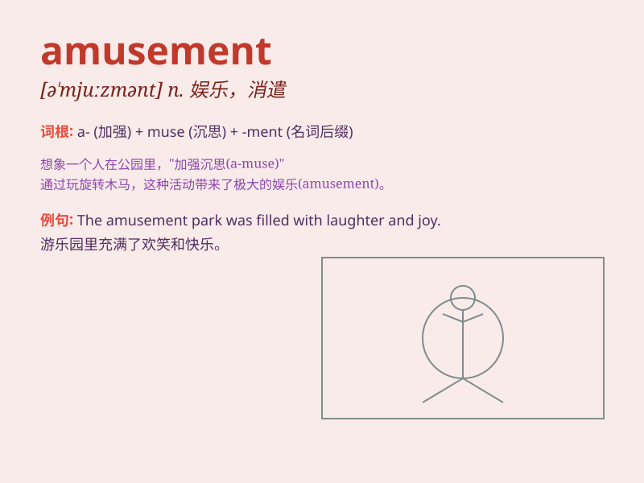

## amusement

**英音:** _[ə\'mjuːzm(ə)nt]_ **美音:** _[ə\'mjuzmənt]_

**译义:** *n.娱乐,消遣,娱乐活动*

### 短语

+ **amusement park:** _游乐园_

+ **in amusement:** _愉快地；饶有趣味地_

+ **amusement arcade:** _电子游乐场；娱乐厅_

+ **sense of amusement:** _娱乐感；愉悦感_

+ **provide amusement:** _提供娱乐_

### 例句

#### 例句1

> **The amusement park was full of excited children.**

**中文翻译:** 游乐园里挤满了兴奋的孩子们。

**单词释义:** 娱乐；消遣

#### 例句2

> **She looked at him with amusement.**

**中文翻译:** 她饶有兴趣地看着他。

**单词释义:** 乐趣；愉悦

#### 例句3

> **To my amusement, he couldn\'t answer the simple question.**

**中文翻译:** 令我感到有趣的是，他竟然无法回答这个简单的问题。

**单词释义:** 可笑；娱乐

### 背诵小故事

> One day, I was feeling down. But then I went to an amusement park.
The colorful rides and funny shows brought me so much joy. I realized
that \'amusement\' means the feeling of having fun and being
entertained.

**有一天，我心情低落。但后来我去了一个游乐园。色彩缤纷的游乐设施和有趣的表演给我带来了很多欢乐。我意识到'amusement'意思是获得乐趣和娱乐的感觉。**

### 图义

