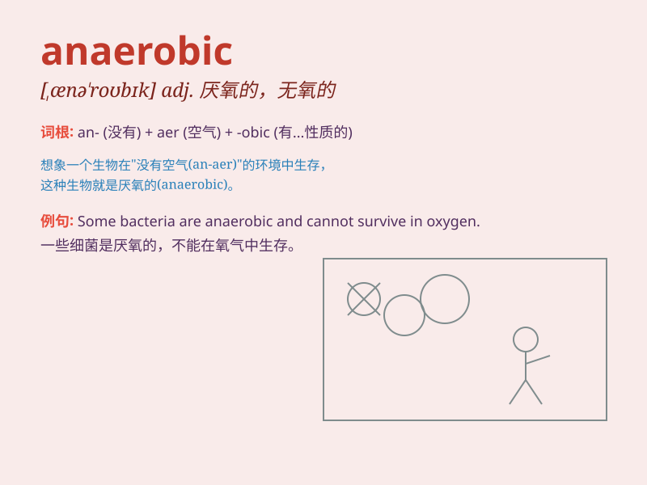

## anaerobic

**英音:** _[,æneə\'rəʊbɪk]_ **美音:** _[,ænɛ\'robɪk]_

**译义:** *adj.[微]没有空气而能生活的,厌氧性的*

### 短语

+ **anaerobic bacteria:** _厌氧菌_

+ **anaerobic digestion:** _厌氧消化_

+ **anaerobic exercise:** _无氧运动_

+ **anaerobic environment:** _厌氧环境_

+ **anaerobic metabolism:** _厌氧代谢_

### 例句

#### 例句1

> **Some bacteria are anaerobic and can survive without oxygen.**

**中文翻译:** 有些细菌是厌氧的，在没有氧气的情况下也能存活。

**单词释义:** 厌氧的

#### 例句2

> **The athlete\'s training included anaerobic exercises to build
strength.**

**中文翻译:** 这位运动员的训练包括无氧运动以增强力量。

**单词释义:** 无氧的

#### 例句3

> **Anaerobic digestion is a process used to treat organic waste.**

**中文翻译:** 厌氧消化是一种用于处理有机废物的过程。

**单词释义:** 厌氧的

### 背诵小故事

>
想象一个运动员在没有氧气的环境中拼命训练，累得气喘吁吁。这种在无氧情况下的状态就是\'anaerobic\'。就像密封的罐子，里面氧气进不来，这就是\'anaerobic\'的场景。

**想象运动员在无氧环境中训练的场景来辅助记忆\'anaerobic\'（无氧的；厌氧的）这个单词**

### 图义

