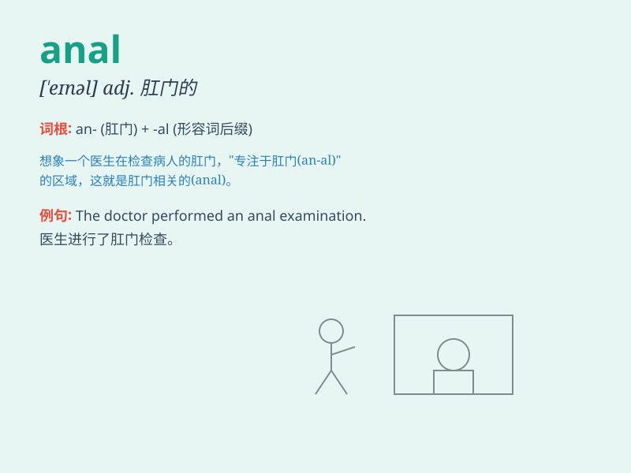

## anal

**英音:** _[\'eɪn(ə)l]_ **美音:** _[\'enl]_

**译义:** *adj.肛门的,近肛门的*

### 短语

+ **anal retentive:** _过分讲究细节和条理的；有洁癖的_

+ **anal fissure:** _肛裂_

+ **anal sex:** _肛交_

+ **anal sphincter:** _肛门括约肌_

+ **anal stage:**
_肛门期（弗洛伊德精神分析理论中的一个发展阶段）_

### 例句

#### 例句1

> **He has an anal personality and pays attention to every
detail.**

**中文翻译:** 他性格谨小慎微，注重每一个细节。

**单词释义:** 谨小慎微的

#### 例句2

> **The doctor performed an anal examination on the patient.**

**中文翻译:** 医生给病人做了肛门检查。

**单词释义:** 肛门的

#### 例句3

> **She has an anal approach to organizing her closet.**

**中文翻译:** 她整理衣柜的方式一丝不苟。

**单词释义:** 一丝不苟的

### 背诵小故事

>
想象一下，有个叫阿娜的人（anal），她对每件事都分析得特别细致，连微小的细节都不放过，就像这个单词'anal'所表达的'肛门的；挑剔的；讲究细节的'意思一样。

**想象有个叫阿娜的人，她的行为体现出'anal'这个单词'肛门的；挑剔的；讲究细节的'的含义。**

### 图义

