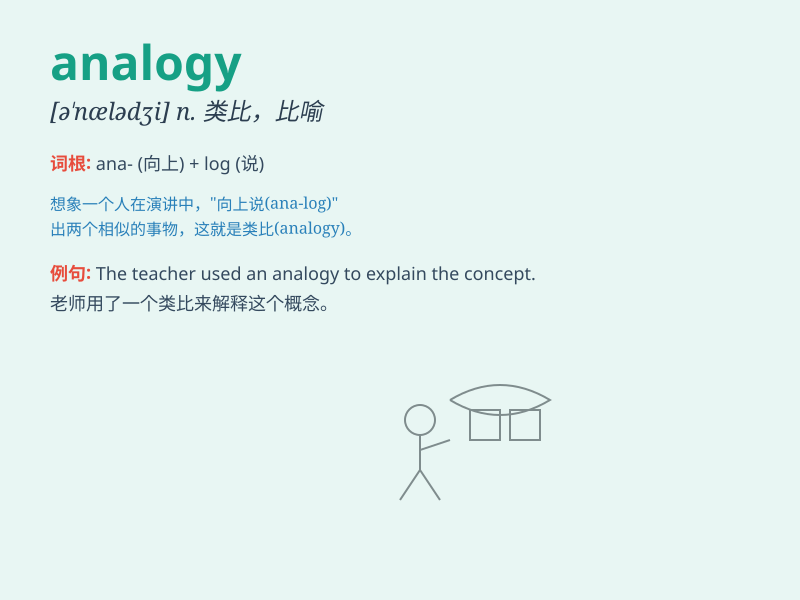

## analogy

**英音:** _[ə\'nælədʒɪ]_ **美音:** _[ə\'nælədʒi]_

**译义:** *n.类似,类推*

### 短语

+ **draw an analogy:** _作类比_

+ **close analogy:** _极其相似_

+ **forced analogy:** _牵强类比_

+ **striking analogy:** _显著的类比_

+ **analogy between:** _在\...\...之间的类比_

### 例句

#### 例句1

> **The teacher used an analogy of a tree to explain the concept of
family.**

**中文翻译:** 老师用一棵树的类比来解释家庭的概念。

**单词释义:** 类比；类推

#### 例句2

> **There is an analogy between the human heart and a pump.**

**中文翻译:** 在人类的心脏和泵之间有一个类似之处。

**单词释义:** 类似；相似

#### 例句3

> **She drew an analogy from her own experience to help him
understand.**

**中文翻译:** 她从自己的经历中做了一个类比来帮助他理解。

**单词释义:** 类比；比喻

### 背诵小故事

> A detective was solving a case. He found an analogy between the
current crime and a past one. Just like two similar puzzles, the
similarities helped him catch the criminal. Remember, \'analogy\' is
like a key to finding similarities.

**一位侦探正在破案。他发现当前的犯罪和过去的一起犯罪有类比之处。就像两个相似的谜题，这些相似之处帮助他抓住了罪犯。记住，\'analogy\'就是寻找相似之处的关键。**

### 图义

