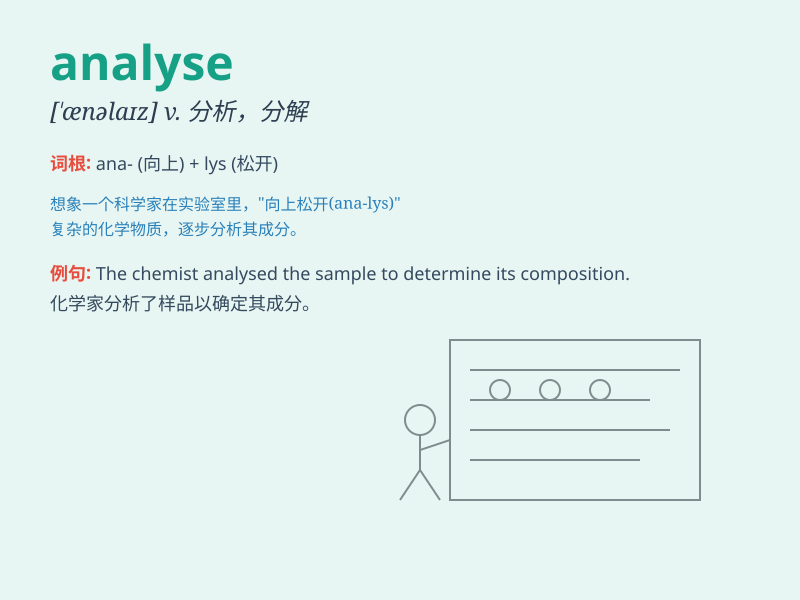

## analyse

**英音:** _[\'æn(ə)laɪz]_ **美音:** _[\'æn(ə)laɪz]_

**译义:** *vt.分析,分解n.分析*

### 短语

+ **analyse data:** _分析数据_

+ **analyse the problem:** _分析问题_

+ **analyse the situation:** _分析情况_

+ **analyse thoroughly:** _彻底分析_

+ **analyse carefully:** _仔细分析_

### 例句

#### 例句1

> **The scientist will analyse the data carefully.**

**中文翻译:** 这位科学家将仔细分析数据。

**单词释义:** 分析

#### 例句2

> **We need to analyse the problem from different perspectives.**

**中文翻译:** 我们需要从不同的角度分析这个问题。

**单词释义:** 分析

#### 例句3

> **The detective is trying to analyse the crime scene.**

**中文翻译:** 这位侦探正试图分析犯罪现场。

**单词释义:** 分析

### 背诵小故事

> A detective was trying to solve a mystery. To do that, he needed to
\'analyse\' every clue carefully. He looked at footprints, fingerprints,
and broken objects. Finally, through his detailed analysis, he found the
criminal.

**一位侦探试图解开一个谜团。为此，他需要仔细"分析"每一条线索。他查看脚印、指纹和破碎的物品。最终，通过他详细的分析，他找到了罪犯。**

### 图义

