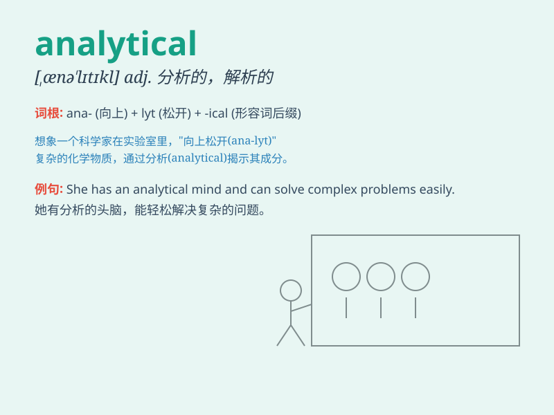

## analytical

**英音:** _[ænə\'lɪtɪk(ə)l]_ **美音:** _[,ænə\'lɪtɪkl]_

**译义:** *adj.分析的,解析的*

### 短语

+ **analytical thinking:** _分析性思维_

+ **analytical method:** _分析方法_

+ **analytical skills:** _分析技能_

+ **analytical report:** _分析报告_

+ **analytical chemistry:** _分析化学_

### 例句

#### 例句1

> **She has an analytical mind and can solve complex problems
easily.**

**中文翻译:** 她有善于分析的头脑，能够轻松解决复杂的问题。

**单词释义:** 善于分析的

#### 例句2

> **The analytical report provided valuable insights into the market
trends.**

**中文翻译:** 这份分析报告为市场趋势提供了有价值的见解。

**单词释义:** 分析的

#### 例句3

> **His analytical skills helped him excel in the field of data
science.**

**中文翻译:** 他的分析技能帮助他在数据科学领域表现出色。

**单词释义:** 分析的

### 背诵小故事

> A detective was known for his analytical skills. He could carefully
study every clue and solve complex cases. His analytical mind helped him
break the code and catch the criminal. Remember, \'analytical\' means
having the ability to analyze carefully.

**一位侦探以其分析能力而闻名。他能够仔细研究每一条线索并解决复杂的案件。他的分析思维帮助他破解密码并抓住罪犯。记住，\'analytical\'意味着有仔细分析的能力。**

### 图义

