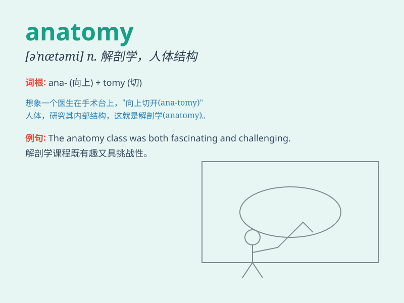

## anatomy

**英音:** _[ə\'nætəmɪ]_ **美音:** _[ə\'nætəmi]_

**译义:** *n.剖析,解剖学*

### 短语

+ **human anatomy:** _人体解剖学_

+ **plant anatomy:** _植物解剖学_

+ **anatomy lesson:** _解剖学课程_

+ **study anatomy:** _学习解剖学_

+ **anatomy textbook:** _解剖学教科书_

### 例句

#### 例句1

> **The study of anatomy is essential for medical students.**

**中文翻译:** 解剖学的学习对于医学生来说至关重要。

**单词释义:** 解剖学

#### 例句2

> **She has a deep knowledge of human anatomy.**

**中文翻译:** 她对人体解剖学有很深的了解。

**单词释义:** 解剖学

#### 例句3

> **The anatomy of the flower is quite complex.**

**中文翻译:** 花的解剖结构相当复杂。

**单词释义:** 结构；构造

### 背诵小故事

>
想象一下，一位勇敢的探险家在古老的图书馆中发现了一本神秘的书籍，上面记载着人体的秘密，这就是\'anatomy\'（解剖学）。通过这本书，他深入了解了人体的构造。

**想象一位探险家在图书馆发现记载人体秘密的书，这帮助记住\'anatomy\'意为解剖学**

### 图义

