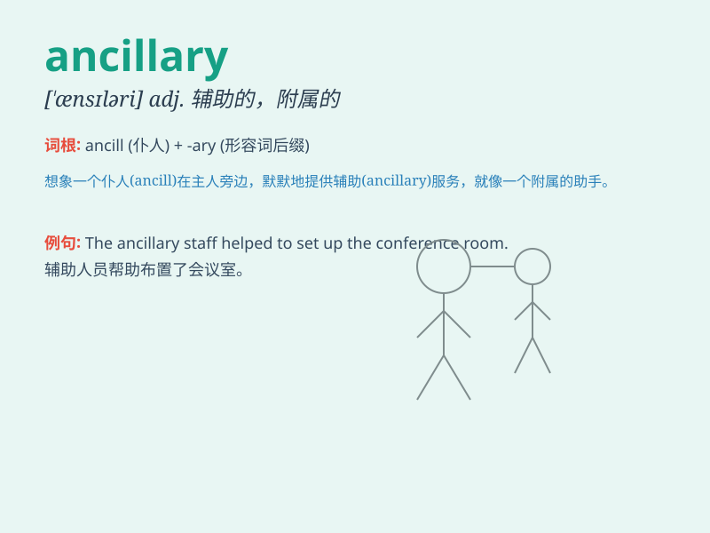

## ancillary

**英音:** _[æn\'sɪlərɪ]_ **美音:** _[\'ænsəlɛri]_

**译义:** *adj.补助的,副的*

### 短语

+ **ancillary equipment:** _辅助设备_

+ **ancillary staff:** _辅助人员_

+ **ancillary services:** _辅助服务_

+ **ancillary business:** _附属业务_

+ **ancillary function:** _辅助功能_

### 例句

#### 例句1

> **Ancillary staff are an important part of our organization.**

**中文翻译:** 辅助人员是我们组织的重要组成部分。

**单词释义:** 辅助的；补充的

#### 例句2

> **The hospital has ancillary services such as a pharmacy and a
cafeteria.**

**中文翻译:** 医院设有药房和自助餐厅等辅助服务设施。

**单词释义:** 附属的；辅助的

#### 例句3

> **Ancillary equipment is necessary for the smooth operation of the
factory.**

**中文翻译:** 辅助设备是工厂顺利运转所必需的。

**单词释义:** 辅助性的

### 背诵小故事

> A king had a loyal servant. This servant did ancillary tasks like
preparing food and cleaning. His work was essential but often unnoticed.
Remember, ancillary means providing additional or supplementary support.

**一位国王有一个忠诚的仆人。这个仆人做着诸如准备食物和打扫之类的辅助工作。他的工作至关重要但常常不被注意。记住，ancillary
意思是提供附加的或补充性的支持。**

### 图义

