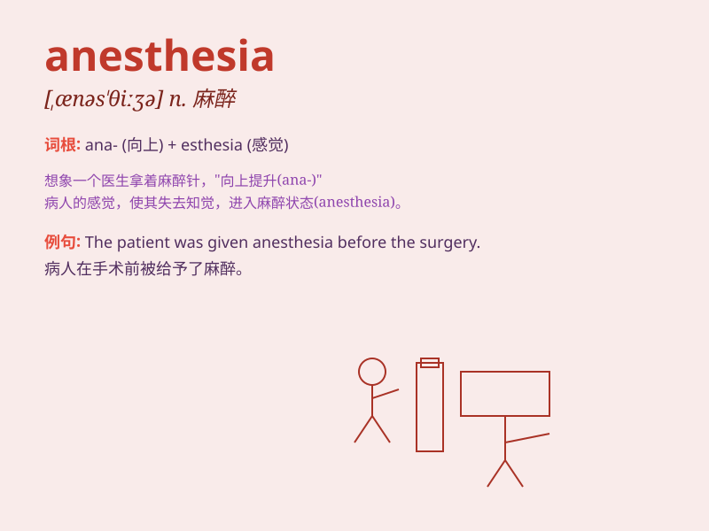

## anesthesia

**英音:** _[,ænɪs\'θiːzɪə]_ **美音:** _[,ænəs\'θiʒə]_

**译义:** *n.=\<美>anaethesia*

### 短语

+ **general anesthesia:** _全身麻醉_

+ **local anesthesia:** _局部麻醉_

+ **epidural anesthesia:** _硬膜外麻醉_

+ **spinal anesthesia:** _脊髓麻醉_

+ **nerve block anesthesia:** _神经阻滞麻醉_

### 例句

#### 例句1

> **The patient was under anesthesia during the surgery.**

**中文翻译:** 病人在手术期间处于麻醉状态。

**单词释义:** 麻醉

#### 例句2

> **Local anesthesia was administered to numb the area.**

**中文翻译:** 局部麻醉被实施以麻痹该区域。

**单词释义:** 麻醉（方式）

#### 例句3

> **After the anesthesia wore off, she started to feel the pain.**

**中文翻译:** 麻醉药效过后，她开始感到疼痛。

**单词释义:** 麻醉（状态）

### 背诵小故事

> A patient was very nervous before the surgery. But the doctor assured
him that with anesthesia, he would feel no pain and just sleep
peacefully like in a sweet dream. Soon, the patient was under anesthesia
and the operation went smoothly.

**一位病人在手术前非常紧张。但医生向他保证，有了麻醉，他不会感到疼痛，会像在甜美的梦中一样安然入睡。很快，病人被麻醉了，手术顺利进行。**

### 图义

