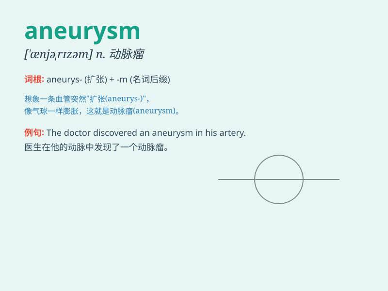

## aneurysm

**英音:** _[\'ænjʊrɪz(ə)m]_ **美音:** _[\'ænjərɪzəm]_

**译义:** *n.动脉瘤*

### 短语

+ **cerebral aneurysm:** _脑动脉瘤_

+ **aortic aneurysm:** _主动脉瘤_

+ **aneurysm rupture:** _动脉瘤破裂_

+ **aneurysm formation:** _动脉瘤形成_

+ **intracranial aneurysm:** _颅内动脉瘤_

### 例句

#### 例句1

> **The doctor diagnosed an aneurysm in his brain.**

**中文翻译:** 医生诊断出他的大脑中有一个动脉瘤。

**单词释义:** 动脉瘤

#### 例句2

> **Aneurysms can be very dangerous if not treated promptly.**

**中文翻译:** 动脉瘤如果不及时治疗会非常危险。

**单词释义:** 动脉瘤

#### 例句3

> **The patient was recovering well after the aneurysm surgery.**

**中文翻译:** 这位病人在动脉瘤手术后恢复得很好。

**单词释义:** 动脉瘤

### 背诵小故事

>
想象有个勇敢的冒险家，在探险时发现了一个奇怪的圆球（ball），它像个气球一样不断膨胀，随时可能爆开。这个圆球就像是动脉瘤（aneurysm），充满了危险和未知。

**想象一个关于动脉瘤的冒险故事，以帮助记忆该单词。**

### 图义

