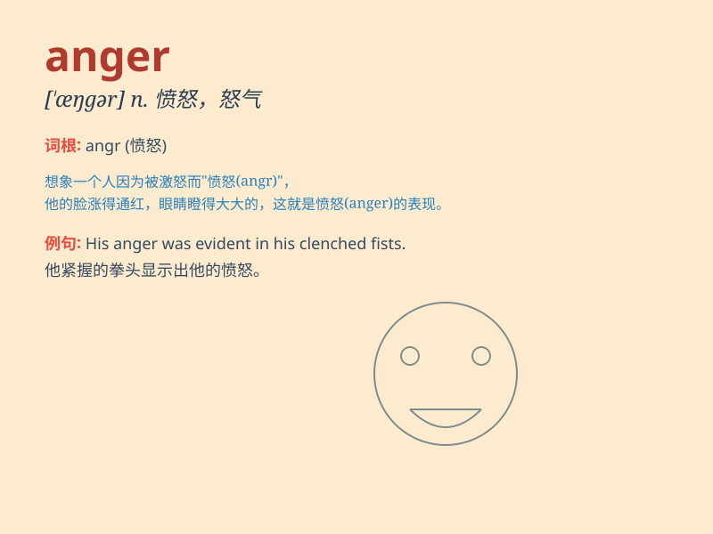

## anger

**英音:** _[\'æŋgə]_ **美音:** _[\'æŋɡɚ]_

**译义:** *n.怒,愤怒v.恼火*

### 短语

+ **in anger:** _生气地，愤怒地_

+ **flare up in anger:** _勃然大怒_

+ **be filled with anger:** _满腔怒火_

+ **anger management:** _愤怒管理_

+ **show anger:** _表现出愤怒_

### 例句

#### 例句1

> **His words angered her greatly.**

**中文翻译:** 他的话让她非常生气。

**单词释义:** 使生气

#### 例句2

> **She tried to control her anger.**

**中文翻译:** 她试图控制自己的愤怒。

**单词释义:** 愤怒

#### 例句3

> **The constant delays filled him with anger.**

**中文翻译:** 持续的延误使他充满了愤怒。

**单词释义:** 愤怒

### 背诵小故事

> One day, Tom\'s little sister broke his favorite toy. This made Tom
feel very angry. His face turned red and he shouted loudly. The feeling
of being angry is what \'anger\' means.

**有一天，汤姆的小妹妹弄坏了他最喜欢的玩具。这让汤姆感到非常生气。他的脸变红了，还大声喊叫。这种生气的感觉就是'anger'的意思。**

### 图义

