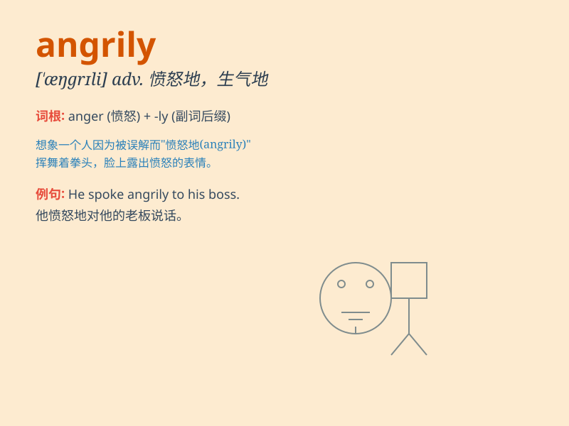

## angrily

**英音:** _[ˈæŋɡrɪlɪ]_ **美音:** _[\'æŋgrɪlɪ]_

**译义:** *adv.愤怒地*

### 短语

+ **speak angrily:** _生气地说_

+ **shout angrily:** _愤怒地呼喊_

+ **look angrily:** _生气地看_

+ **react angrily:** _生气地反应_

+ **reply angrily:** _生气地回复_

### 例句

#### 例句1

> **He shouted angrily at the naughty child.**

**中文翻译:** 他生气地对着那个调皮的孩子大喊。

**单词释义:** 生气地

#### 例句2

> **She left the room angrily after the argument.**

**中文翻译:** 争论过后，她生气地离开了房间。

**单词释义:** 生气地

#### 例句3

> **The boss looked at him angrily when he made the mistake.**

**中文翻译:** 当他犯错时，老板生气地看着他。

**单词释义:** 生气地

### 背诵小故事

> One day, Tom lost his favorite toy. He looked for it everywhere but
couldn\'t find it. He became very frustrated and shouted angrily,
\'Where is my toy!\'

**有一天，汤姆丢了他最喜欢的玩具。他到处找但都找不到。他变得非常沮丧，生气地大喊：'我的玩具在哪！'**

### 图义

