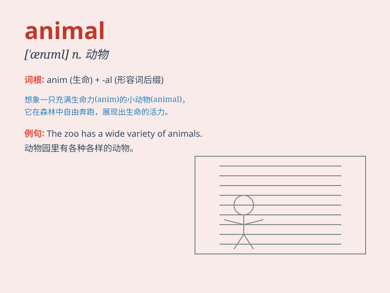

## animal

**英音:** _[\'ænɪm(ə)l]_ **美音:** _[\'ænɪml]_

**译义:** *n.动物*

### 短语

+ **wild animal:** _野生动物_

+ **domestic animal:** _家畜；家养动物_

+ **marine animal:** _海洋动物_

+ **rare animal:** _珍稀动物_

+ **farm animal:** _农场动物_

### 例句

#### 例句1

> **The zoo has many kinds of animals, such as lions and
giraffes.**

**中文翻译:** 动物园里有很多种类的动物，比如狮子、长颈鹿。

**单词释义:** 动物（泛指各种动物）

#### 例句2

> **She loves animals and often volunteers at the animal shelter.**

**中文翻译:** 她热爱动物，经常在动物收容所做志愿者。

**单词释义:** 动物（统称）

#### 例句3

> **The little boy has a toy animal that looks like a dog.**

**中文翻译:** 这个小男孩有一个看起来像狗的玩具动物。

**单词释义:** 动物（这里指玩具动物）

### 背诵小故事

> One day, I went to the zoo and saw many kinds of animals. There were
cute monkeys jumping around, fierce lions roaring, and gentle giraffes
eating leaves. All these animals made the zoo a lively place.

**有一天，我去了动物园，看到了许多种动物。有可爱的猴子到处蹦跳，凶猛的狮子吼叫，还有温和的长颈鹿吃树叶。所有这些动物让动物园成为一个热闹的地方。**

### 图义

