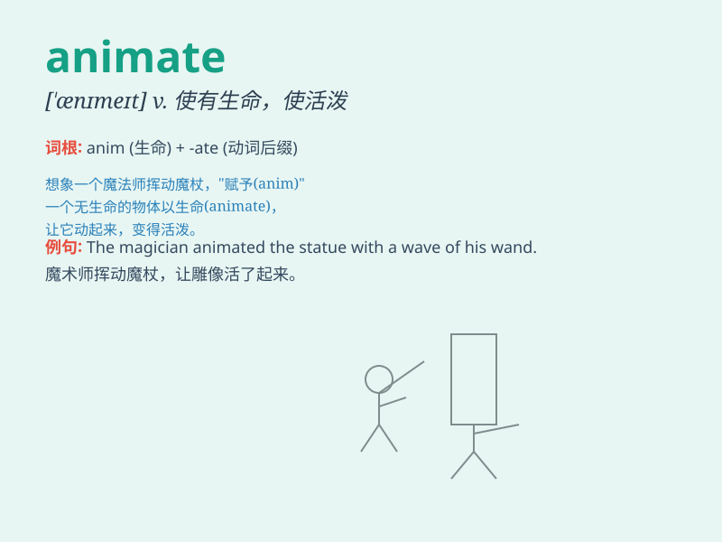

## animate

**英音:** _[\'ænɪmeɪt]_ **美音:** _[\'ænɪmet]_

**译义:** *v.鼓舞adj.生气勃勃的*

### 短语

+ **animate object:** _有生命的物体_

+ **animate being:** _生物；动物_

+ **animate force:** _活力；生命力_

+ **animate nature:** _生机勃勃的大自然_

+ **animate discussion:** _热烈的讨论_

### 例句

#### 例句1

> **The cartoon is animated with vivid characters.**

**中文翻译:** 这部漫画形象生动，人物形象生动。

**单词释义:** 使有生气；使活泼

#### 例句2

> **Her smile animated her face.**

**中文翻译:** 她的笑容使她的脸充满生气。

**单词释义:** 使有活力；使生动

#### 例句3

> **The teacher\'s enthusiasm animated the class.**

**中文翻译:** 老师的热情使班级充满了活力。

**单词释义:** 激励；鼓舞

### 背诵小故事

> Once upon a time, there was a lonely puppet. A magician used magic to
animate it, making it come alive and dance happily. \'Animate\' means to
bring to life or make lively.

**从前，有一个孤独的木偶。一位魔法师用魔法使它有了生命，让它活跃起来并快乐地跳舞。\'animate\'这个单词意思是使有活力；使生动。**

### 图义

