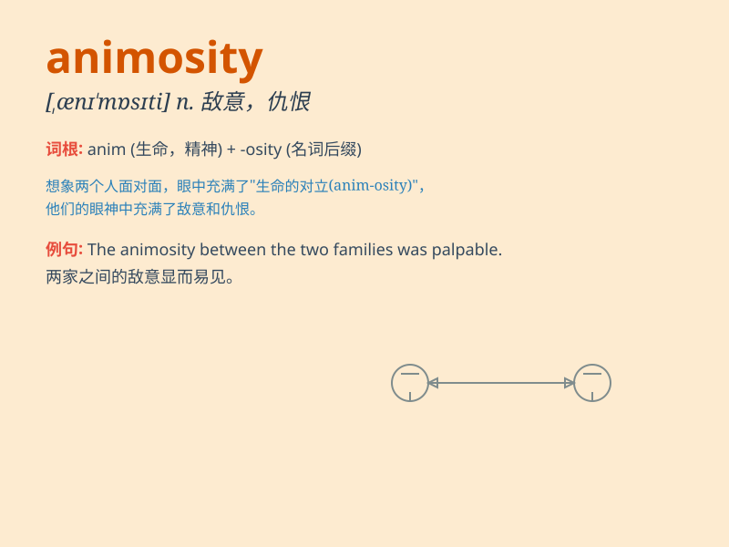

## animosity

**英音:** _[,ænɪ\'mɒsɪtɪ]_ **美音:** _[\'ænə\'mɑsəti]_

**译义:** *n.仇恨,憎恶*

### 短语

+ **bear animosity towards:** _对\...\...怀有敌意_

+ **harbour animosity:** _心怀仇恨_

+ **feel animosity:** _感到敌意_

+ **show animosity:** _表现出敌意_

+ **overcome animosity:** _克服敌意_

### 例句

#### 例句1

> **There was a great deal of animosity between the two political
parties.**

**中文翻译:** 两个政党之间存在很大的敌意。

**单词释义:** 敌意

#### 例句2

> **His animosity towards his former boss was obvious.**

**中文翻译:** 他对前任老板的敌意显而易见。

**单词释义:** 敌意

#### 例句3

> **The animosity between the neighbors had been brewing for
years.**

**中文翻译:** 邻居之间的仇恨已经酝酿多年。

**单词释义:** 仇恨

### 背诵小故事

> A mouse and a cat always met in a narrow alley. The cat showed
animosity towards the mouse, chasing it every time. The mouse was scared
and felt the strong hatred from the cat. So, \'animosity\' means strong
dislike or hatred.

**一只老鼠和一只猫总是在一条狭窄的小巷相遇。猫对老鼠表现出敌意，每次都追它。老鼠很害怕，感受到了猫强烈的憎恶。所以，\'animosity\'意思是强烈的厌恶或仇恨。**

### 图义

