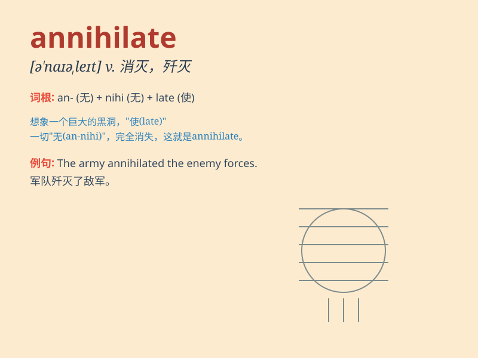

## annihilate

**英音:** _[ə\'naɪɪleɪt]_ **美音:** _[ə\'naɪəlet]_

**译义:** *vt.消灭,歼灭*

### 短语

+ **annihilate the enemy:** _消灭敌人_

+ **annihilate hope:** _破灭希望_

+ **annihilate resistance:** _消除抵抗_

+ **annihilate evidence:** _销毁证据_

+ **annihilate memory:** _抹去记忆_

### 例句

#### 例句1

> **The enemy forces were completely annihilated in the battle.**

**中文翻译:** 敌军在战斗中被彻底消灭了。

**单词释义:** 消灭；歼灭

#### 例句2

> **The earthquake annihilated the small town.**

**中文翻译:** 地震摧毁了这个小镇。

**单词释义:** 毁灭；摧毁

#### 例句3

> **His argument annihilated all my objections.**

**中文翻译:** 他的论点驳倒了我所有的反对意见。

**单词释义:** 驳倒；使无效

### 背诵小故事

> A powerful warrior was determined to annihilate the evil army that
had been terrorizing the land. With his might and skills, he completely
wiped them out, leaving no trace. Thus, \'annihilate\' means to destroy
completely.

**一位强大的战士决心消灭一直在这片土地上肆虐的邪恶军队。凭借他的力量和技能，他将他们彻底消灭，不留痕迹。因此，\'annihilate\'意思是彻底毁灭。**

### 图义

