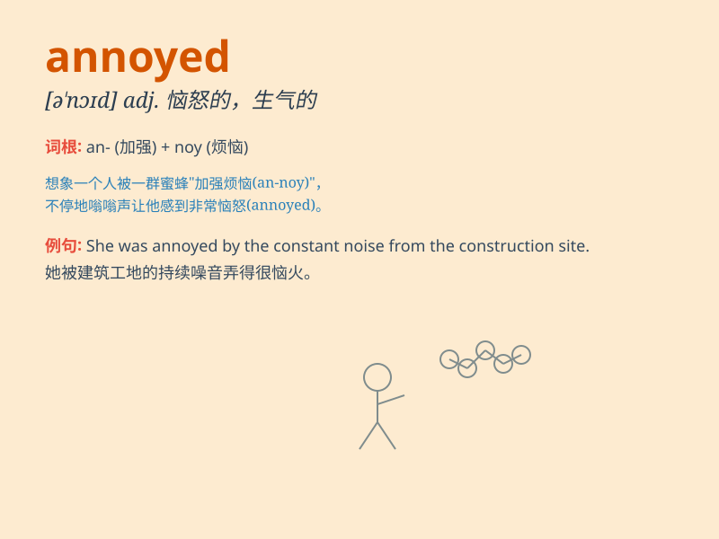

## annoyed

**英音:** _[ə\'nɔɪd]_ **美音:** _[ə\'noɪd]_

**译义:** *adj. 恼怒的，烦闷的，令人讨厌的*

### 短语

+ **be annoyed with:** _对\...\...生气_

+ **be annoyed at:** _因\...\...而恼怒_

+ **be annoyed about:** _为\...\...感到烦恼_

+ **get annoyed:** _变得生气_

+ **look annoyed:** _看起来生气_

### 例句

#### 例句1

> **I was annoyed by his constant complaining.**

**中文翻译:** 我被他不停地抱怨惹恼了。

**单词释义:** 感到恼怒的

#### 例句2

> **She looked annoyed when I interrupted her.**

**中文翻译:** 当我打断她时，她看起来很生气。

**单词释义:** 生气的；恼怒的

#### 例句3

> **He got annoyed with me for being late.**

**中文翻译:** 他因为我迟到而对我生气。

**单词释义:** 生气的；恼怒的

### 背诵小故事

> One day, Tom was constantly disturbed by a fly buzzing around him. He
couldn\'t focus on his work and became very annoyed. Finally, he decided
to catch the fly to get some peace.

**有一天，汤姆不断地被一只在他周围嗡嗡叫的苍蝇打扰。他无法专心工作，变得非常恼怒。最后，他决定抓住这只苍蝇以求安宁。**

### 图义

