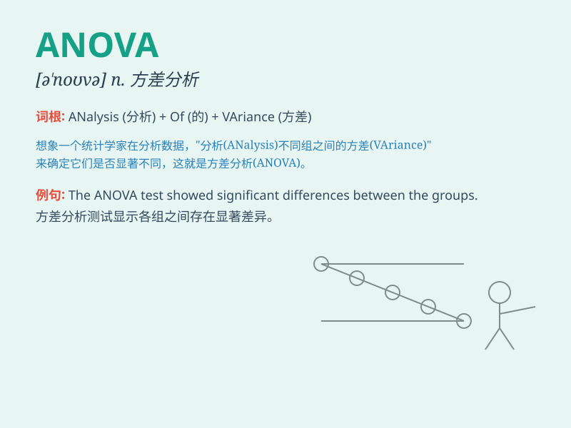

## ANOVA

**英音:** _[ˈænəvə]_ **美音:** _[ˈænəvə]_

**译义:**
*分析方差；一种统计学方法，用于检验多个样本均值之间是否存在显著差异*

### 短语

+ **One-way ANOVA:** _单因素方差分析_

+ **Two-way ANOVA:** _双因素方差分析_

+ **Repeated measures ANOVA:** _重复测量方差分析_

+ **ANOVA test:** _方差分析检验_

+ **Multivariate ANOVA:** _多元方差分析_

### 例句

#### 例句1

> **The researcher used ANOVA to analyze the data from the
experiment.**

**中文翻译:** 研究人员使用方差分析来分析实验中的数据。

**单词释义:**
方差分析（一种统计方法，用于比较两个或多个组的均值是否存在显著差异）

#### 例句2

> **ANOVA showed a significant difference between the treatment
groups.**

**中文翻译:** 方差分析显示治疗组之间存在显著差异。

**单词释义:** 方差分析

#### 例句3

> **We relied on ANOVA to determine the effect of the variables.**

**中文翻译:** 我们依靠方差分析来确定变量的影响。

**单词释义:** 方差分析

### 背诵小故事

> A scientist was conducting experiments and constantly dealing with
data. To analyze the variance, he relied on a powerful method called
ANOVA. It helped him make precise conclusions and solve complex
problems.

**一位科学家正在进行实验并不断处理数据。为了分析方差，他依靠一种强大的方法叫做方差分析（ANOVA）。它帮助他得出精确的结论并解决复杂的问题。**

### 图义

