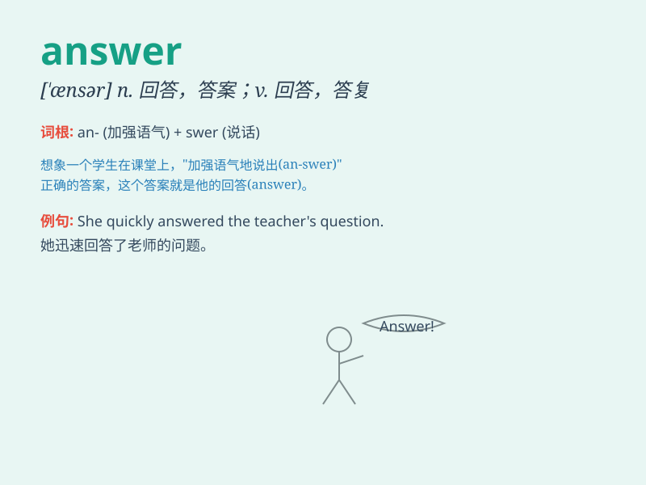

## answer

**英音:** _[\'ɑːnsə]_ **美音:** _[\'ænsɚ]_

**译义:** *n.答案,回答,答辩,抗辩v.回答说,答复说,符合,反响,响应*

### 短语

+ **answer the phone:** _接电话_

+ **answer back:** _顶嘴；回嘴_

+ **answer for:** _对...负责；因...受到谴责_

+ **in answer to:** _作为对...的回答_

+ **answer the door:** _应门；去开门_

### 例句

#### 例句1

> **Please answer this question.**

**中文翻译:** 请回答这个问题。

**单词释义:** 回答

#### 例句2

> **I knocked at the door but no one answered.**

**中文翻译:** 我敲了门，但没人应答。

**单词释义:** 应答；回应

#### 例句3

> **The phone kept ringing but she didn\'t answer.**

**中文翻译:** 电话一直响，但她没接。

**单词释义:** 接（电话）

### 背诵小故事

> One day, Tom was lost in a forest. He shouted loudly for help.
Finally, a kind man heard him and gave him the right direction. Tom was
so grateful and said, \'You have provided the answer to my problem!\'

**一天，汤姆在森林里迷路了。他大声呼救。最后，一位善良的人听到了他，并给他指明了正确的方向。汤姆非常感激并说道：'你给了我问题的答案！'**

### 图义

