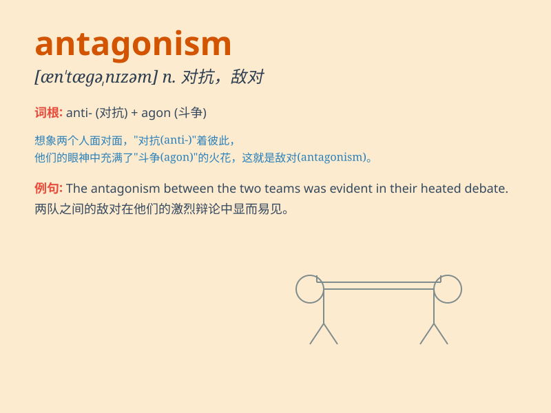

## antagonism

**英音:** _[æn\'tæg(ə)nɪz(ə)m]_ **美音:**
_[æn\'tæɡənɪzəm]_

**译义:** *n.对抗(状态),对抗性*

### 短语

+ **mutual antagonism:** _相互对抗_

+ **political antagonism:** _政治对立_

+ **racial antagonism:** _种族对抗_

+ **class antagonism:** _阶级对抗_

+ **commercial antagonism:** _商业竞争_

### 例句

#### 例句1

> **There was a lot of antagonism between the two political
parties.**

**中文翻译:** 这两个政党之间存在很多敌对情绪。

**单词释义:** 敌对；对抗

#### 例句2

> **His antagonism towards his boss led to his dismissal.**

**中文翻译:** 他对老板的敌对态度导致他被解雇。

**单词释义:** 敌对；对抗

#### 例句3

> **The antagonism between the siblings was obvious to everyone.**

**中文翻译:** 兄弟姐妹之间的对立对每个人来说都很明显。

**单词释义:** 对立；敌意

### 背诵小故事

> A brave knight was always facing the evil dragon. The dragon\'s
hostility and the knight\'s resistance formed a clear antagonism. They
fought fiercely, showing the intense conflict of this word.

**一位勇敢的骑士总是面对邪恶的巨龙。巨龙的敌意和骑士的抵抗形成了明显的对抗。他们激烈战斗，展现了'antagonism'这个词所代表的强烈冲突。**

### 图义

