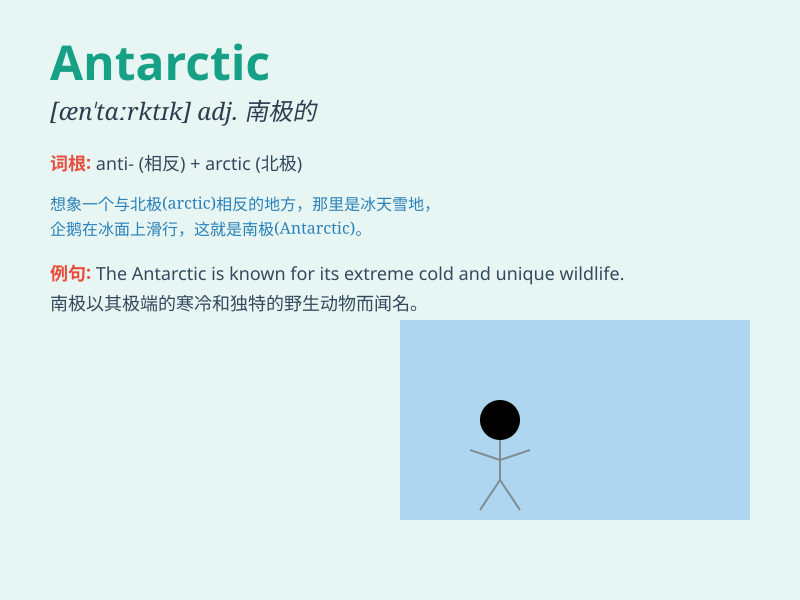

## Antarctic

**英音:** _[ænˈtɑːktɪk]_ **美音:** _[ænˈtɑːrktɪk]_

**译义:** *adj.南极的;南极地区的n.南极洲;南极地区*

### 短语

+ **Antarctic Circle:** _南极圈_

+ **Antarctic Peninsula:** _南极半岛_

+ **Antarctic Treaty:** _南极条约_

+ **Antarctic Ocean:** _南冰洋_

+ **Antarctic Expedition:** _南极探险_

### 例句

#### 例句1

> **The Antarctic is a harsh and inhospitable environment.**

**中文翻译:** 南极洲是一个恶劣且不适宜居住的环境。

**单词释义:** 南极洲

#### 例句2

> **Scientists conduct research in the Antarctic to understand
climate change.**

**中文翻译:** 科学家在南极洲进行研究以了解气候变化。

**单词释义:** 南极洲

#### 例句3

> **The Antarctic Treaty aims to protect the region\'s unique
ecosystem.**

**中文翻译:** 《南极条约》旨在保护该地区独特的生态系统。

**单词释义:** 南极洲的

### 背诵小故事

> A brave adventurer set off for a journey to the Antarctic. He faced
extreme cold and strong winds but was amazed by the unique beauty.
Remember, the place he explored was the \'Antarctic\' - the southernmost
and icy region.

**一位勇敢的冒险家启程前往南极。他面临极度寒冷和强风，但对独特的美景感到惊叹。记住，他探索的这个地方就是\'南极\'------最南端且冰雪覆盖的地区。**

### 图义

