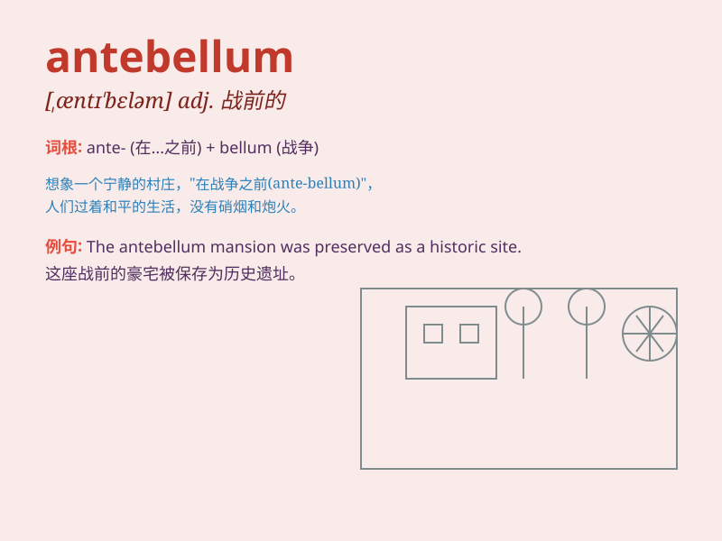

## antebellum

**英音:** _[ˌæntiˈbeləm]_ **美音:** _[ˌæntiˈbeləm]_

**译义:** *adj.\<美>战前的(尤指南北战争前的)*

### 短语

+ **antebellum architecture:** _战前建筑_

+ **antebellum south:** _战前南方_

+ **antebellum society:** _战前社会_

+ **antebellum era:** _战前时代_

+ **antebellum mansion:** _战前大厦_

### 例句

#### 例句1

> **The antebellum mansion was a symbol of wealth and elegance.**

**中文翻译:** 这座战前的大厦是财富和优雅的象征。

**单词释义:** 战前的

#### 例句2

> **She was interested in the antebellum social structure.**

**中文翻译:** 她对战前的社会结构感兴趣。

**单词释义:** 战前的

#### 例句3

> **The antebellum period witnessed significant changes in the
economy.**

**中文翻译:** 战前时期见证了经济的重大变化。

**单词释义:** 战前的

### 背诵小故事

> In the antebellum South, a young girl named Lily dreamt of a peaceful
world before the war. She wrote in her diary about the beautiful
mansions and happy times. \'Antebellum\' means before a war, and for
Lily, it was a time of innocence.

**在南北战争前的南方，一个叫莉莉的年轻女孩梦想着战前的和平世界。她在日记中写下了美丽的宅邸和快乐的时光。'antebellum'意思是战前，对莉莉来说，那是一段纯真的时光。**

### 图义

