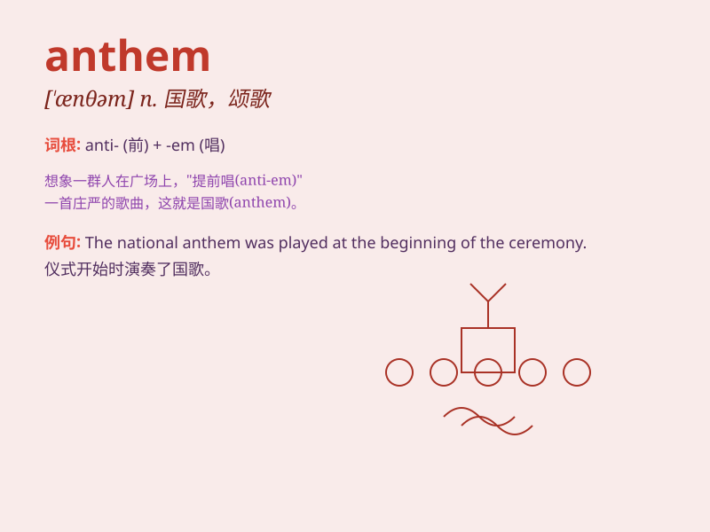

## anthem

**英音:** _[\'ænθəm]_ **美音:** _[\'ænθəm]_

**译义:** *n.圣歌,赞美诗*

### 短语

+ **national anthem:** _国歌_

+ **anthem singer:** _颂歌演唱者_

+ **anthem tune:** _颂歌曲调_

+ **anthem lyrics:** _颂歌歌词_

+ **choral anthem:** _合唱颂歌_

### 例句

#### 例句1

> **The national anthem was sung with great pride.**

**中文翻译:** 国歌响起，大家充满自豪。

**单词释义:** 国歌

#### 例句2

> **The choir performed a beautiful anthem at the church service.**

**中文翻译:** 唱诗班在教堂仪式上演奏了优美的圣歌。

**单词释义:** 颂歌

#### 例句3

> **The team\'s anthem inspired them to victory.**

**中文翻译:** 队歌激励他们走向胜利。

**单词释义:** 队歌

### 背诵小故事

> A group of ants were having a party. They sang a special song
together, and that song was called the \'anthem\'. It was a song that
made them feel united and happy. So, remember, \'anthem\' is like a
special song for a group.

**一群蚂蚁正在举办派对。它们一起唱了一首特别的歌，这首歌被称为"颂歌"。这是一首让它们感到团结和快乐的歌。所以，记住，"anthem"就像是一个群体的特别歌曲。**

### 图义

