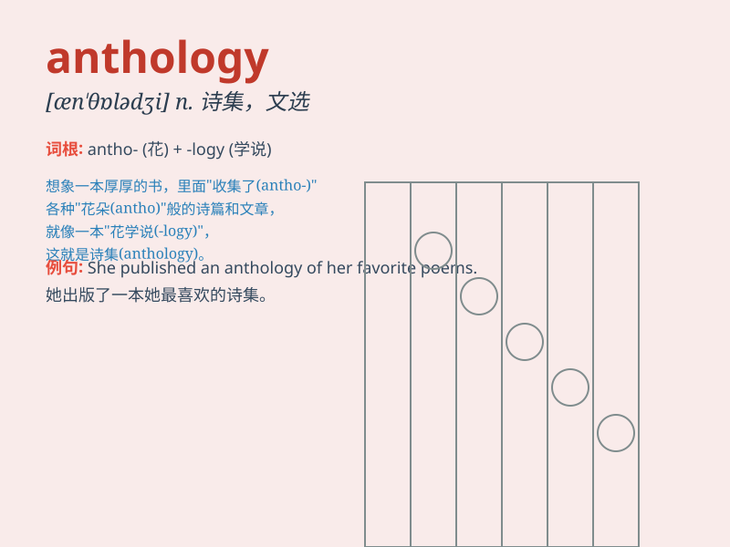

## anthology

**英音:** _[æn\'θɒlədʒɪ]_ **美音:** _[æn\'θɑlədʒi]_

**译义:** *n.诗选,文选*

### 短语

+ **poetry anthology:** _诗歌选集_

+ **literary anthology:** _文学选集_

+ **anthology of short stories:** _短篇小说选集_

+ **classic anthology:** _经典选集_

+ **anthology of essays:** _散文集_

### 例句

#### 例句1

> **This anthology contains works by various famous poets.**

**中文翻译:** 这本选集收录了多位著名诗人的作品。

**单词释义:** 选集

#### 例句2

> **The anthology of short stories is very popular among readers.**

**中文翻译:** 该短篇小说集深受读者欢迎。

**单词释义:** 选集

#### 例句3

> **She published an anthology of her own poems last year.**

**中文翻译:** 她去年出版了自己的诗集。

**单词释义:** 选集

### 背诵小故事

> 想象一个神秘的图书馆，里面收藏着各种珍贵的作品。这个图书馆就叫
\'anthology\'
，它就像一个装满了不同作者优秀作品的宝箱。人们可以从这里领略到各种精彩的文学风采。

**想象一个关于'anthology（选集；文集）'的神秘图书馆的故事，帮助理解这个单词的含义。**

### 图义

