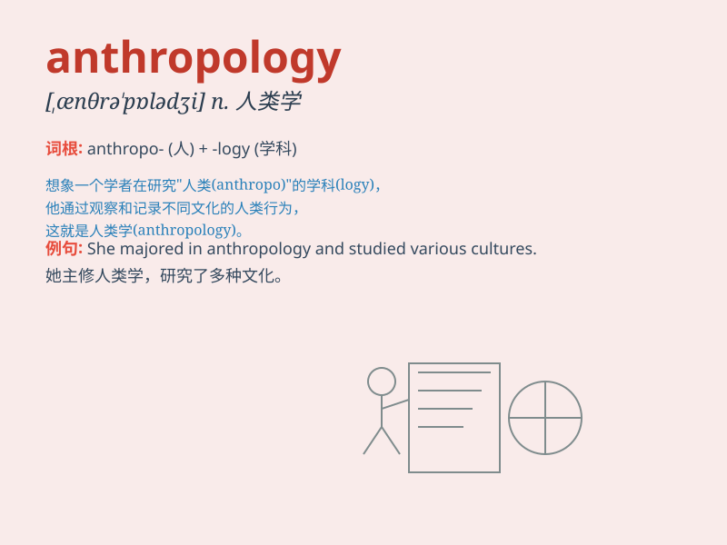

## anthropology

**英音:** _[,ænθrə\'pɒlədʒɪ]_ **美音:**
_[\'ænθrə\'pɑlədʒi]_

**译义:** *n.人类学*

### 短语

+ **cultural anthropology:** _文化人类学_

+ **physical anthropology:** _体质人类学_

+ **social anthropology:** _社会人类学_

+ **anthropological research:** _人类学研究_

+ **anthropological perspective:** _人类学视角_

### 例句

#### 例句1

> **Anthropology is the study of human societies and cultures.**

**中文翻译:** 人类学是对人类社会和文化的研究。

**单词释义:** 人类学

#### 例句2

> **She decided to major in anthropology at university.**

**中文翻译:** 她决定在大学主修人类学。

**单词释义:** 人类学

#### 例句3

> **The professor of anthropology gave an interesting lecture.**

**中文翻译:** 人类学教授做了一次有趣的讲座。

**单词释义:** 人类学

### 背诵小故事

>
想象一下，有个勇敢的探险家，他深入各种人群，研究人类的起源和发展。他所从事的工作就是anthropology。这个词就像是打开人类奥秘之门的钥匙，引领我们了解人类的过去和现在。

**想象一下，有个勇敢的探险家，他深入各种人群，研究人类的起源和发展。他所从事的工作就是人类学。这个词就像是打开人类奥秘之门的钥匙，引领我们了解人类的过去和现在。**

### 图义

