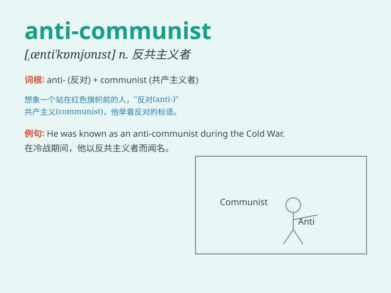

## anti-communist

**英音:** _[ˈænti ˈkɒmjʊnɪst]_ **美音:** _[ˈænti
ˈkɑːmjʊnɪst]_

**译义:** *n. 反共主义者；adj. 反共的*

### 短语

+ **anti-communist ideology:** _反共意识形态_

+ **anti-communist campaign:** _反共运动_

+ **anti-communist sentiment:** _反共情绪_

+ **anti-communist propaganda:** _反共宣传_

+ **anti-communist measures:** _反共措施_

### 例句

#### 例句1

> **He was accused of being an anti-communist.**

**中文翻译:** 他被指控为反共分子。

**单词释义:** 反共的

#### 例句2

> **The anti-communist propaganda had a negative impact on
society.**

**中文翻译:** 反共宣传对社会产生了负面影响。

**单词释义:** 反共的

#### 例句3

> **Some people hold anti-communist views, but they are not based on
facts.**

**中文翻译:** 有些人持有反共观点，但这些观点并非基于事实。

**单词释义:** 反共的

### 背诵小故事

> In a fictional land, a villain named Anti-Communist was always trying
to undermine the fair and equal society that the communists were
building. But in the end, his evil plans were exposed and defeated.

**在一个虚构的国度，有个叫反共产主义者的坏蛋，总是企图破坏共产党人正在建设的公平和平等的社会。但最终，他的邪恶计划被曝光并被挫败。**

### 图义

