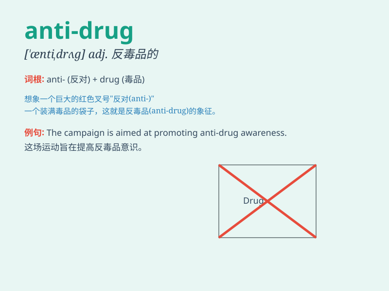

## anti-drug

**英音:** _[\'ænti \'drʌɡ]_ **美音:** _[\'ænti \'drʌɡ]_

**译义:** *adj. 禁毒的；反毒品的*

### 短语

+ **anti-drug campaign:** _禁毒运动_

+ **anti-drug policy:** _禁毒政策_

+ **anti-drug education:** _禁毒教育_

+ **anti-drug law:** _禁毒法律_

+ **anti-drug operation:** _禁毒行动_

### 例句

#### 例句1

> **The government has launched an anti-drug campaign to reduce drug
abuse.**

**中文翻译:** 政府发起了一场禁毒运动以减少药物滥用。

**单词释义:** 反对毒品的；禁毒的

#### 例句2

> **She is actively involved in anti-drug education in schools.**

**中文翻译:** 她积极参与学校的禁毒教育。

**单词释义:** 反对毒品的；禁毒的

#### 例句3

> **The police are strengthening their anti-drug efforts to keep the
community safe.**

**中文翻译:** 警方正在加强他们的禁毒工作以保障社区安全。

**单词释义:** 反对毒品的；禁毒的

### 背诵小故事

> Once upon a time, there was a brave detective. His mission was to
fight against the bad guys involved in the anti-drug business. He risked
his life to stop the spread of drugs and protect people\'s safety.

**从前，有一位勇敢的侦探。他的任务是打击参与禁毒工作的坏人。他冒着生命危险阻止毒品的传播，保护人们的安全。**

### 图义

