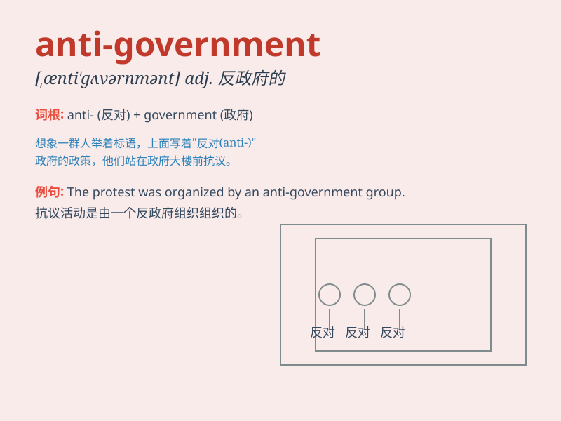

## anti-government

**英音:** _[ˌænti ˈɡʌvənmənt]_ **美音:** _[ˌænti
ˈɡʌvərnmənt]_

**译义:** *adj.反政府的*

### 短语

+ **anti-government protest:** _反政府抗议_

+ **anti-government sentiment:** _反政府情绪_

+ **anti-government movement:** _反政府运动_

+ **anti-government forces:** _反政府力量_

+ **anti-government rhetoric:** _反政府言论_

### 例句

#### 例句1

> **The anti-government protests attracted a large number of
participants.**

**中文翻译:** 反政府抗议活动吸引了大量参与者。

**单词释义:** 反政府的

#### 例句2

> **He was accused of being involved in anti-government
activities.**

**中文翻译:** 他被指控参与反政府活动。

**单词释义:** 反政府的

#### 例句3

> **The anti-government sentiment is growing among the citizens.**

**中文翻译:** 市民中的反政府情绪正在增长。

**单词释义:** 反政府的

### 背诵小故事

> In a fictional country, a group of brave citizens stood up against
the unfair rules of the government. They were called anti-government
protesters. They fought for justice and a better life for all.

**在一个虚构的国家里，一群勇敢的公民站出来反对政府的不公平规则。他们被称为反政府抗议者。他们为正义和所有人更好的生活而斗争。**

### 图义

