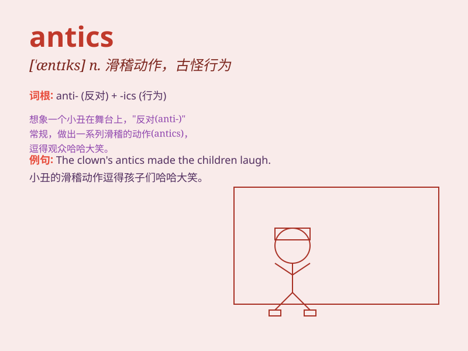

## antics

**英音:** _[ˈæntɪks]_ **美音:** _[ˈæntɪks]_

**译义:** *n.滑稽的动作,古怪的姿态*

### 短语

+ **childish antics:** _幼稚的滑稽动作_

+ **comical antics:** _滑稽可笑的古怪动作_

+ **clownish antics:** _小丑般的滑稽行为_

+ **ridiculous antics:** _荒谬的滑稽举止_

+ **playful antics:** _顽皮的滑稽表现_

### 例句

#### 例句1

> **The monkey\'s antics in the zoo amused the children.**

**中文翻译:** 动物园里猴子的滑稽动作逗乐了孩子们。

**单词释义:** 滑稽动作

#### 例句2

> **His antics at the party made everyone laugh.**

**中文翻译:** 他在聚会上的滑稽表现让每个人都大笑。

**单词释义:** 滑稽表现

#### 例句3

> **The clown\'s antics were the highlight of the circus show.**

**中文翻译:** 小丑的滑稽表演是马戏表演的亮点。

**单词释义:** 滑稽表演

### 背诵小故事

> Once upon a time, a monkey showed its antics in the zoo. It jumped
around, made funny faces, and did all kinds of crazy things. People were
amused by its antics.

**从前，一只猴子在动物园里展示它的古怪滑稽的动作。它跳来跳去，做着滑稽的鬼脸，做着各种疯狂的事情。人们被它的滑稽动作逗乐了。**

### 图义

