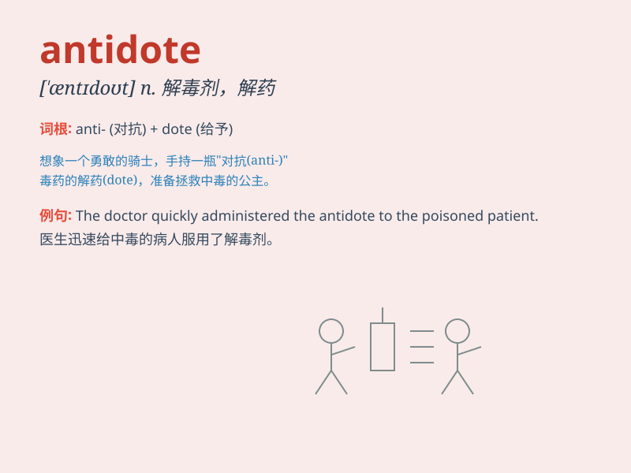

## antidote

**英音:** _[\'æntɪdəʊt]_ **美音:** _[\'æntɪdot]_

**译义:** *n.[医]解毒剂,矫正方法*

### 短语

+ **antidote to:** _针对\...的解毒剂；解决\...的办法_

+ **find an antidote:** _找到解毒剂_

+ **effective antidote:** _有效的解毒剂_

+ **natural antidote:** _天然解毒剂_

+ **provide an antidote:** _提供解毒剂_

### 例句

#### 例句1

> **The antidote to boredom is finding a new hobby.**

**中文翻译:** 消除无聊的方法是找到一个新的爱好。

**单词释义:** 解毒药；解药；消除不快的手段

#### 例句2

> **There is no known antidote for this poison.**

**中文翻译:** 这种毒药没有已知的解药。

**单词释义:** 解毒药；解药

#### 例句3

> **Laughter can be an antidote to stress.**

**中文翻译:** 笑可以是缓解压力的一剂良药。

**单词释义:** 消除不快的手段；缓解不良情况的方法

### 背诵小故事

> A scientist was working hard in the lab to find a cure for a deadly
poison. After many experiments, he finally discovered a special
substance - the antidote. It saved countless lives and became a symbol
of hope.

**一位科学家在实验室里努力工作，试图找到一种致命毒药的解药。经过多次实验，他终于发现了一种特殊的物质------解毒剂。它拯救了无数生命，成为了希望的象征。**

### 图义

